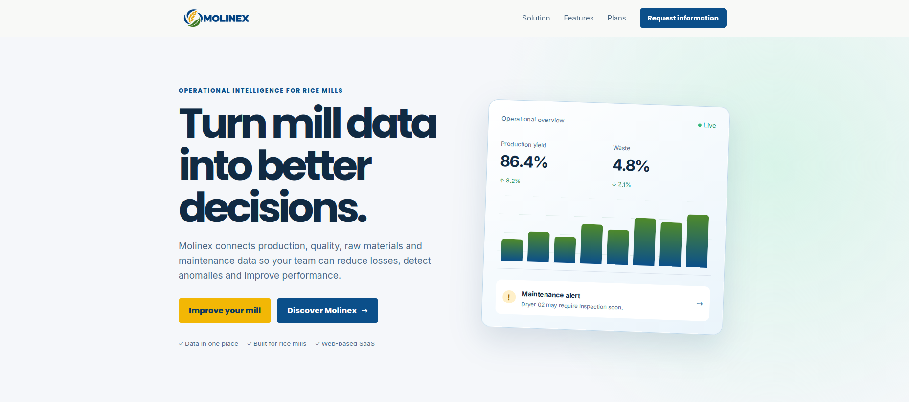

<div align="center">


Universidad Peruana de Ciencias Aplicadas<br>
Carrera de Ingeniería de Software<br>

### 1ASI0730
### Aplicaciones Web

**NRC**
### 8088

## Informe de Trabajo Final

**Docente**<br>
### Bautista Ubillús, Efraín Ricardo

Equipo<br>
**Vanguard**

Proyecto<br>
**Molinex**<br><br>

**Integrantes**<br><br>

<table style="margin: 0 auto; border-collapse: collapse; border: none;">
  <tr style="border: none;">
    <th style="border: none; text-align: left; padding-right: 30px;">Código</th>
    <th style="border: none; text-align: left;">Apellidos y Nombres</th>
  </tr>
  <tr style="border: none;">
    <td style="border: none; text-align: left; padding-right: 30px;">u202424008</td>
    <td style="border: none; text-align: left;">Casalino Berrocal, Luisa Nhiriel</td>
  </tr>
  <tr style="border: none;">
    <td style="border: none; text-align: left; padding-right: 30px;">u202424466</td>
    <td style="border: none; text-align: left;">Gallegos De La Cruz, Giovanni Marcelo</td>
  </tr>
  <tr style="border: none;">
    <td style="border: none; text-align: left; padding-right: 30px;">u20241e550</td>
    <td style="border: none; text-align: left;">Huerta Cardenas, Brayan Benjamin</td>
  </tr>
  <tr style="border: none;">
    <td style="border: none; text-align: left; padding-right: 30px;">u202420031</td>
    <td style="border: none; text-align: left;">Jimenez Saavedra, Antony Alexander</td>
  </tr>
  <tr style="border: none;">
    <td style="border: none; text-align: left; padding-right: 30px;">u202423883</td>
    <td style="border: none; text-align: left;">Rivera Rupay, Fabricio Jose</td>
  </tr>
</table>
<br>

**Periodo 202620**

**Septiembre 2026**

</div>
<div style="page-break-after: always;"></div>

## Registro de Versiones del Informe

| Versión | Fecha | Autor | Descripción de la modificación |
|:--:|:--:|:--|:--|
| AV1 |  |  ||
|0.1|14/09|Luisa Casalino|Desarrolle los segmentos objetivos y el análisis competitivo de Molinex.|
|0.2|14/09|Antony Jimenez|descripción inicial de la startup y se configuró la estructura inicial del proyecto.|
|0.3|15/09|Brayan Huerta|Se realizaron correcciones y actualizaciones relacionadas con la descripción de la startup, perfiles del equipo y análisis de entrevistas.|
|0.4|16/09|Antony Jimenez Saavedra|Se incorporo el registro de entrevistas, análisis de entrevistas y User Task Matrix.|
|0.5|16/09|Luisa Nhiriel Casalino|Se agregaron User Person, User Journey Map, Empathy Mapping y Ubiquitous Language.|
|0.6|17/09|Antony Jimenez Saavedra|Se actualizaron los perfiles de los integrantes y se incorporaron evidencias adicionales del proyecto.|
|0.7|17/09|Brayan Huerta|Se realizaron correcciones en hipótesis, perfiles del equipo y análisis de entrevistas.|
|0.8|17/09|Fabricio Rivera|Se incorporaron Style Guidelines, Information Architecture, Big Picture Event Storming, Design-Level Event Storming, arquitectura de software y diagramas de clases.|
|0.9|18/09|Fabricio Rivera|Se agregó el diagrama de base de datos y se completaron elementos del diseño técnico.|
|1.0|18/09|Giovanni Gallegos|Se agregaron los wireflows, wireframes, prototipo de aplicación web y evidencias de la Landing Page.|
|1.1|19/09|Giovanni Gallegos|Se completaron las secciones del informe correspondientes a AV1 y se agregaron evidencias.|
|1.2|19/09|Equipo Vanguard|Consolidación y revisión de las secciones del informe correspondientes a la evaluación AV1.|<div style="page-break-after: always;"></div>

## Project Report Collaboration Insights

## AV1

Para el desarrollo del informe perteneciente a la entrega TB1, se dividió la implementación de las diferentes secciones y actividades del proyecto Molinex entre los integrantes del equipo. La distribución presentada a continuación se basa en las actividades registradas mediante ramas y commits en el repositorio del proyecto.

| Integrante | Tareas Designadas |
| --- | --- |
| **Antony Alexander Jimenez Saavedra** | Registro y análisis de entrevistas, Interview Record, Interview Analysis, User Task Matrix, Lean UX Canvas, Product Backlog, Impact Mapping, Mapping, enlace del Backlog y Sprint Backlog. |
| **Luisa Nhiriel Casalino Berrocal** | User Person, User Journey Map, Empathy Mapping, Ubiquitous Language, User Stories, Sprint Planning 1, Aspect Leaders and Collaborators y Student Outcome. |
| **Giovanni Marcelo Gallegos De La Cruz** | Wireframes de la aplicación web, Wireflows, prototipo de aplicación web, evidencias de la Landing Page, documentación de diseño y consolidación de secciones del informe para AV1. |
| **Brayan Benjamin Huerta Cardenas** | Análisis de la Landing Page, wireframe y mockup de la Landing Page, perfiles de integrantes, correcciones de la descripción de la startup y ajustes del análisis de entrevistas. |
| **Fabricio Jose Rivera Rupay** | Style Guidelines, Information Architecture, Big Picture Event Storming, Design-Level Event Storming, arquitectura de software, diagramas de clases y diagrama de base de datos. |


### Repositorios del proyecto

- Project Report: `https://github.com/Vanguard-app-web/molinex-report-apweb`
- Landing Page: `https://github.com/Vanguard-app-web/molinex-website-apweb`
- Frontend Web Application: repositorio pendiente de creación (fuera del alcance de despliegue de este AV1).
- RESTful API: repositorio pendiente de creación (fuera del alcance de despliegue de este AV1).

### Entrega AV1

Durante la entrega AV1 se avanzó en la elaboración y consolidación de los principales artefactos del proyecto Molinex. Se desarrollaron los perfiles de los integrantes, el análisis de entrevistas, User Person, User Journey Map, Empathy Mapping, User Task Matrix, Lean UX Canvas, User Stories, Product Backlog e Impact Mapping. Asimismo, se trabajó en el diseño de la solución mediante Style Guidelines, Information Architecture, Big Picture Event Storming, Design-Level Event Storming, wireframes, wireflows y el prototipo de la aplicación web.

También se desarrollaron elementos relacionados con la arquitectura y el diseño técnico, como el modelo C4, diagramas de clases y diagrama de base de datos. Finalmente, se incorporaron evidencias de la Landing Page, Sprint Planning 1, Sprint Backlog, Aspect Leaders and Collaborators, Student Outcome y demás secciones requeridas para la consolidación del informe de la AV1.

El trabajo se realizó de manera colaborativa mediante ramas y commits en el repositorio, permitiendo integrar los avances de cada integrante en la rama de desarrollo.


#### Participación del equipo

- Casalino Berrocal, Luisa Nhiriel
- Gallegos De La Cruz, Giovanni Marcelo
- Huerta Cardenas, Brayan Benjamin
- Jimenez Saavedra, Antony Alexander
- Rivera Rupay, Fabricio Jose

#### Evidencias de colaboración y commits

El equipo gestionó el desarrollo del informe mediante ramas de GitHub bajo el modelo GitFlow, con una rama `feature/` por cada sección y su posterior integración en `develop` mediante `git flow feature finish`. La evidencia visual de las ramas utilizadas, el historial de commits y los GitHub Insights del repositorio se presenta en la sección 5.2.1.8 (Team Collaboration Insights during Sprint).

<div style="page-break-after: always;"></div>

## Contenido

- [Student Outcome](#student-outcome)
- [Capítulo I Introducción](#capítulo-i-introducción)
- [1.1 Startup Profile](#11-startup-profile)
  - [1.1.1 Descripción de la Startup](#111-descripción-de-la-startup)
  - [1.1.2 Perfiles de integrantes del equipo](#112-perfiles-de-integrantes-del-equipo)
- [1.2 Solution Profile](#12-solution-profile)
  - [1.2.1 Antecedentes y problemática](#121-antecedentes-y-problemática)
  - [1.2.2 Lean UX Process](#122-lean-ux-process)
    - [1.2.2.1 Lean UX Problem Statements](#1221-lean-ux-problem-statements)
    - [1.2.2.2 Lean UX Assumptions](#1222-lean-ux-assumptions)
    - [1.2.2.3 Lean UX Hypothesis Statements](#1223-lean-ux-hypothesis-statements)
    - [1.2.2.4 Lean UX Canvas](#1224-lean-ux-canvas)
- [1.3 Segmentos objetivo](#13-segmentos-objetivo)
- [Capítulo II Requirements Elicitation & Analysis](#capítulo-ii-requirements-elicitation-analysis)
- [2.1 Competidores](#21-competidores)
  - [2.1.1 Análisis competitivo](#211-análisis-competitivo)
  - [2.1.2 Estrategias y tácticas frente a competidores](#212-estrategias-y-tácticas-frente-a-competidores)
- [2.2 Entrevistas](#22-entrevistas)
  - [2.2.1 Diseño de entrevistas](#221-diseño-de-entrevistas)
  - [2.2.2 Registro de entrevistas](#222-registro-de-entrevistas)
  - [2.2.3 Análisis de entrevistas](#223-análisis-de-entrevistas)
- [2.3 Needfinding](#23-needfinding)
  - [2.3.1 User Personas](#231-user-personas)
  - [2.3.2 User Task Matrix](#232-user-task-matrix)
  - [2.3.3 User Journey Mapping](#233-user-journey-mapping)
  - [2.3.4 Empathy Mapping](#234-empathy-mapping)
- [2.4 Big Picture Event Storming](#24-big-picture-event-storming)
- [2.5 Ubiquitous Language](#25-ubiquitous-language)
- [Capítulo III Requirements Specification](#capítulo-iii-requirements-specification)
- [3.1 User Stories](#31-user-stories)
- [3.2 Impact Mapping](#32-impact-mapping)
- [3.3 Product Backlog](#33-product-backlog)
- [Capítulo IV Product Design](#capítulo-iv-product-design)
- [4.1 Style Guidelines](#41-style-guidelines)
  - [4.1.1 General Style Guidelines](#411-general-style-guidelines)
  - [4.1.2 Web Style Guidelines](#412-web-style-guidelines)
- [4.2 Information Architecture](#42-information-architecture)
  - [4.2.1 Organization Systems](#421-organization-systems)
  - [4.2.2 Labeling Systems](#422-labeling-systems)
  - [4.2.3 SEO Tags and Meta Tags](#423-seo-tags-and-meta-tags)
  - [4.2.4 Searching Systems](#424-searching-systems)
  - [4.2.5 Navigation Systems](#425-navigation-systems)
- [4.3 Landing Page UI Design](#43-landing-page-ui-design)
  - [4.3.1 Landing Page Wireframe](#431-landing-page-wireframe)
  - [4.3.2 Landing Page Mockup](#432-landing-page-mockup)
- [4.4 Web Applications UX/UI Design](#44-web-applications-uxui-design)
  - [4.4.1 Web Applications Wireframes](#441-web-applications-wireframes)
  - [4.4.2 Web Applications Wireflow Diagrams](#442-web-applications-wireflow-diagrams)
  - [4.4.3 Web Applications Mockups](#443-web-applications-mockups)
  - [4.4.4 Web Applications User Flow Diagrams](#444-web-applications-user-flow-diagrams)
- [4.5 Web Applications Prototyping](#45-web-applications-prototyping)
- [4.6 Domain-Driven Software Architecture](#46-domain-driven-software-architecture)
  - [4.6.1 Design-Level Event Storming](#461-design-level-event-storming)
  - [4.6.2 Software Architecture Context Diagram](#462-software-architecture-context-diagram)
  - [4.6.3 Software Architecture Container Diagrams](#463-software-architecture-container-diagrams)
  - [4.6.4 Software Architecture Components Diagrams](#464-software-architecture-components-diagrams)
- [4.7 Software Object-Oriented Design](#47-software-object-oriented-design)
  - [4.7.1 Class Diagrams](#471-class-diagrams)
- [4.8 Database Design](#48-database-design)
  - [4.8.1 Database Diagrams](#481-database-diagrams)
- [Capítulo V Product Implementation, Validation & Deployment](#capítulo-v-product-implementation-validation-deployment)
- [5.1 Software Configuration Management](#51-software-configuration-management)
  - [5.1.1 Software Development Environment Configuration](#511-software-development-environment-configuration)
  - [5.1.2 Source Code Management](#512-source-code-management)
  - [5.1.3 Source Code Style Guide & Coding Conventions](#513-source-code-style-guide-coding-conventions)
  - [5.1.4 Software Deployment Configuration](#514-software-deployment-configuration)
- [5.2 Landing Page, Services & Applications Implementation](#52-landing-page-services-applications-implementation)
  - [5.2.1 Sprint 1](#521-sprint-1)
    - [5.2.1.1 Sprint Planning 1](#5211-sprint-planning-1)
    - [5.2.1.2 Aspect Leaders and Collaborators](#5212-aspect-leaders-and-collaborators)
    - [5.2.1.3 Sprint Backlog 1](#5213-sprint-backlog-1)
    - [5.2.1.4 Development Evidence for Sprint Review](#5214-development-evidence-for-sprint-review)
    - [5.2.1.5 Execution Evidence for Sprint Review](#5215-execution-evidence-for-sprint-review)
    - [5.2.1.6 Services Documentation Evidence for Sprint Review](#5216-services-documentation-evidence-for-sprint-review)
    - [5.2.1.7 Software Deployment Evidence for Sprint Review](#5217-software-deployment-evidence-for-sprint-review)
    - [5.2.1.8 Team Collaboration Insights during Sprint](#5218-team-collaboration-insights-during-sprint)
- [Conclusiones](#conclusiones)
- [Conclusiones y recomendaciones](#conclusiones-y-recomendaciones)
- [Bibliografía](#bibliografía)
- [Anexos](#anexos)
- [Anexo A. Videos de Exposiciones](#anexo-a-videos-de-exposiciones)

<div style="page-break-after: always;"></div>

## Student Outcome

El curso contribuye al cumplimiento del Student Outcome ABET:

**ABET – EAC - Student Outcome 5**

Criterio: La capacidad de funcionar efectivamente en un equipo cuyos miembros juntos proporcionan liderazgo, crean un entorno de colaboración e inclusivo, establecen objetivos, planifican tareas y cumplen objetivos.

En el siguiente cuadro se describe las acciones realizadas y enunciados de conclusiones por parte del grupo, que permiten sustentar el haber alcanzado el logro del ABET – EAC - Student Outcome 5.

|Criterio específico | Acciones realizadas | Conclusiones |
| :--- | :--- | :--- |
| **Trabaja en equipo para proporcionar liderazgo en forma conjunta** | **Casalino Berrocal, Luisa Nhiriel**<br>**AV1:** Coordiné la distribución de roles del equipo en la reunión de planificación, ajusté las secciones del informe según las correcciones del docente sobre el alcance de Molinex y lideré la grabación del video "About The Team", presentando la visión general del proyecto.<br>**TB1:** Lideré la sesión de estimación y priorización del Sprint Planning 2 en Discord, guiando al equipo en la asignación de responsabilidades para el desarrollo de la interfaz de la Web Application (Vue.js / PrimeVue) y asumiendo la conducción del módulo de control de calidad y desperdicios.<br><br>**Gallegos De La Cruz, Giovanni Marcelo**<br>**AV1:** Lideré la discusión técnica sobre la arquitectura del software en las reuniones virtuales, corrigiendo las inconsistencias observadas en las secciones del dominio y orientando al equipo hacia decisiones conjuntas sobre la Landing Page.<br>**TB1:** Conduje el Sprint Planning 2 en Discord presentando el Sprint Goal y la velocidad del equipo, guiando la adopción del framework Vue.js con PrimeVue y liderando el diseño técnico e implementación del módulo de gestión de producción (US-05, US-06, US-07).<br><br>**Huerta Cardenas, Brayan Benjamin**<br>**AV1:** Propuse y guié la definición del alcance del dominio y la gestión de materia prima durante las reuniones de planificación, reestructurando las historias de usuario iniciales tras la retroalimentación del AV1 y representando al equipo en la presentación en video.<br>**TB1:** Asumí el liderazgo en el refinamiento del Product Backlog para el Sprint 2, coordinando en llamadas grupales el desglose de Historias de Usuario a Work-Items y liderando la implementación del módulo de recepción de materia prima e inventarios.<br><br>**Jimenez Saavedra, Antony Alexander**<br>**AV1:** Lideré la definición del Product Backlog en las sesiones grupales, corrigiendo la redacción de los criterios de aceptación del AV1 y coordinando con mis compañeros el desglose de las historias del Sprint 1.<br>**TB1:** Asumí el liderazgo de la gestión técnica del repositorio en GitHub, definiendo las políticas de ramas (GitFlow), estandarizando las directrices para Conventional Commits y supervisando las revisiones de código (Pull Requests) del equipo.<br><br>**Rivera Rupay, Fabricio Jose**<br>**AV1:** Conduje las reuniones de planificación, aplicando las observaciones del docente respecto a la propuesta de valor y planes de suscripción, y representé esa visión refinada en la presentación en video del equipo.<br>**TB1:** Lideré el seguimiento del cumplimiento del Sprint Goal 2 mediante Daily Standups en Discord y coordiné la consolidación general del informe final del TB1, garantizando que el despliegue actualizado de la Landing Page cumpla con los estándares exigidos. | Como conclusión de este primer avance, identificamos que ejercer liderazgo compartido desde el inicio del proyecto evita que un solo integrante concentre las decisiones: cada miembro asumió en algún momento la conducción de una actividad (planificación, definición de alcance, backlog o presentación en video), lo cual fortaleció el sentido de corresponsabilidad del equipo. Esta forma de liderazgo distribuido nos permitió avanzar con una dirección clara desde el Sprint 1 y sienta una base sólida para que, en las siguientes entregas, el liderazgo continúe rotando según la naturaleza de cada actividad.<br><br>**TB1:** En la entrega TB1, consolidamos la rotación de liderazgo en la parte técnica y de gestión. La conducción compartida en la arquitectura de Frontend (Vue.js/PrimeVue), el flujo de trabajo en GitHub mediante GitFlow y el seguimiento diario del Sprint 2 permitieron resolver bloqueos técnicos con agilidad. Esto demostró que distribuir las responsabilidades fortalece la autonomía del equipo ante entregables de mayor complejidad técnica. |
| **Crea un entorno colaborativo e inclusivo, establece metas, planifica tareas y cumple objetivos.** | **Casalino Berrocal, Luisa Nhiriel**<br>**AV1:** Estructuré el Sprint Planning 1 y el Sprint Backlog, subsanando los detalles señalados por el docente para establecer metas de Sprint claras y organizar las tareas del equipo de manera equitativa.<br>**TB1:** Diseñé y desarrollé las vistas de la Web Application en Vue.js para el módulo de Quality & Waste Control (US-11 y US-14), articulando con mis compañeros las llamadas de API mockeadas y el flujo de navegación de las pruebas de calidad.<br><br>**Gallegos De La Cruz, Giovanni Marcelo**<br>**AV1:** Desglosé las tareas técnicas (Work-Items) del primer Sprint, corregí los esquemas del sistema y documenté los requisitos, manteniendo al equipo alineado mediante actualizaciones constantes por WhatsApp y Discord.<br>**TB1:** Implementé la estructura base de componentes e integración con PrimeVue en la Web Application, cumpliendo los Work-Items asignados para la gestión de lotes y fases de producción en el Sprint Backlog 2.<br><br>**Huerta Cardenas, Brayan Benjamin**<br>**AV1:** Definí formalmente las Historias de Usuario (US-01 a US-04 y US-35 a US-40), corrigiendo sus descripciones en inglés y español según la retroalimentación del AV1 para fijar metas objetivas y medibles.<br>**TB1:** Desarrollé e integré los componentes y formularios del módulo de recepción de materia prima (US-01 a US-04) en la aplicación web, verificando en llamadas grupales que la navegación estuviera sincronizada con los demás módulos.<br><br>**Jimenez Saavedra, Antony Alexander**<br>**AV1:** Colaboré en la reestructuración del informe tras las observaciones del docente, ajustando los planes de suscripción y aportando las referencias bibliográficas que respaldan la propuesta del sistema.<br>**TB1:** Implementé componentes de la interfaz gráfica en la Web Application, aprobé los Pull Requests del equipo en GitHub garantizando la integración continua del código y documenté las evidencias de desarrollo en el informe.<br><br>**Rivera Rupay, Fabricio Jose**<br>**AV1:** Consolidé el trabajo del equipo en el repositorio Git, revisando que se aplicaran las correcciones indicadas y que los entregables cumplieran con las métricas exigidas para el envío del Avance 1.<br>**TB1:** Actualicé y desplegué la nueva versión de la Landing Page en el servidor de Hosting, verificando el cumplimiento del Definition of Done (DoD) para cada una de las historias de usuario desarrolladas en el Sprint 2. | La construcción de un entorno colaborativo e inclusivo ha sido clave desde este primer avance: cada integrante planificó y cumplió tareas concretas (Sprint Planning, Sprint Backlog, Historias de Usuario, documentación de requisitos y consolidación del repositorio) que en conjunto permitieron alcanzar la meta del Sprint 1. Mantenernos alineados mediante canales de comunicación constantes reforzó la sensación de pertenencia y corresponsabilidad del equipo, sentando las bases para que en las próximas entregas sigamos estableciendo metas conjuntas y cumpliendo los objetivos planificados.<br><br>**TB1:** Durante el desarrollo del TB1, el trabajo colaborativo permitió cumplir satisfactoriamente con la primera versión de la Web Application y la actualización del Landing Page. La distribución equitativa de los Work-Items, sumada a la asistencia mutua en Discord para solucionar errores de layout e integración con PrimeVue, aseguró el cumplimiento del 100% de las historias de usuario comprometidas en el Sprint 2. |
<div style="page-break-after: always;"></div>

# Capítulo I Introducción

## 1.1 Startup Profile

### 1.1.1 Descripción de la Startup

**Vanguard** es una startup tecnológica que desarrolla soluciones digitales para optimizar las operaciones de los molinos de arroz. Su producto, **Molinex**, es una plataforma web basada en el modelo **SaaS** que integra y analiza datos de producción, calidad, mantenimiento y materia prima para detectar anomalías, identificar posibles causas de pérdidas y generar recomendaciones que mejoren el rendimiento operativo.

Molinex está dirigida a molinos pequeños, medianos y grandes, y ofrece tres planes de suscripción: **Básico, Profesional y Empresarial**, adaptados a las necesidades de cada cliente.

**Misión:**
Ayudar a gerentes, técnicos de mantenimiento y operarios de molinos de arroz a centralizar sus datos de producción, calidad y mantenimiento, para que puedan detectar a tiempo las causas de sus pérdidas y tomar decisiones basadas en información confiable, en lugar de registros dispersos o manuales.

**Visión:**
Ser la plataforma de referencia en inteligencia operativa para la industria arrocera del Perú, reconocida por ayudar a los molinos a anticipar fallas de maquinaria y reducir mermas mediante análisis de datos, y expandir esta propuesta hacia otros países productores de arroz en Latinoamérica.

**Valores:**

* **Innovación:** Aplicar análisis de datos y detección de anomalías para resolver problemas reales del proceso de molienda, en lugar de ofrecer solo reportes o dashboards genéricos.
* **Eficiencia:** Reducir el tiempo que toma detectar una falla o una desviación de calidad, para que cada hora de operación del molino se traduzca en menos pérdidas de materia prima.
* **Transparencia:** Explicar con claridad el origen de cada indicador, alerta y recomendación que muestra la plataforma, para que gerentes, técnicos y operarios confíen en la información que reciben.
* **Compromiso:** Acompañar a cada molino cliente durante la adopción de la plataforma, ajustando sus funcionalidades según el plan de suscripción y las necesidades reales de su operación.
* **Sostenibilidad:** Contribuir a reducir la merma y el desperdicio de materia prima mediante la detección temprana de anomalías y el mantenimiento preventivo.


### 1.1.2 Perfiles de integrantes del equipo
| Nombre completo | Código | Carrera | Fotografía | Conocimientos y habilidades |
|:--|:--:|:--|:--:|:--|
| Casalino Berrocal, Luisa Nhiriel | u202424008 | Ingeniería de Software, UPC ||Como una estudiante de la carrera de Ingeniería de Software . Forma parte del equipo aportando experiencia en C++ y un dominio práctico de la Programación Orientada a Objetos, lo que me permite desarrollar soluciones técnicas funcionales y crear herramientas útiles para el proyecto. Se caracteriza por analizar los procesos de manera crítica para hacerlos más ágiles y sostenibles, además de contar con facilidad para organizar ideas y generar propuestas creativas.|
| Gallegos De La Cruz, Giovanni Marcelo | u202424466 | Ingeniería de Software, UPC ||Soy un estudiante de Ingeniería de Software, cuento con habilidades técnicas en tecnologías como HTML, CSS, JavaScript, Java, y SQL , además de un gran entusiasmo por la ciencia y la innovación. Soy proactivo y tengo una sólida capacidad para la colaboración, la versatilidad ante nuevos retos y la resolución eficiente de problemas, lo que me permite sumar valor e impulsar resultados positivos en proyectos académicos y en equipo.|
| Huerta Cardenas, Brayan Benjamin | u20241e550 | Ingeniería de Software, UPC | | Soy estudiante de Ingeniería de Software con conocimientos en HTML, CSS, JavaScript, Java, C++, SQL y MongoDB, y con especial interés en la ciencia y la tecnología. Me considero una persona con aptitudes técnicas y una actitud proactiva para el trabajo colaborativo, capaz de adaptarme a distintos entornos y resolver problemas de manera eficiente, lo que me ha permitido aportar valor en proyectos grupales y académicos. |
| Jimenez Saavedra, Antony Alexander | u202420031 | Ingeniería de Software, UPC | |Soy un estudiante de la carrera de Ingeniería de Software,con conocimientos en HTML, Java, C++. Soy una persona responsable y proactiva, capaz de afrontar cualquier reto con creatividad y dedicación. Además,tengo una gran capacidad de adaptación y facilidad para comunicarse le permiten aportar un valor significativo para alcanzar las metas grupales.|
| Rivera Rupay, Fabricio Jose | u202423883 | Ingeniería de Software, UPC ||Como estudiante de Ingeniería de Software, cuento con habilidades técnicas en tecnologías como HTML, C++, CSS, JavaScript, Java y SQL, además de un gran entusiasmo por la ciencia y la innovación. Tengo una actitud proactiva y una sólida capacidad para la colaboración, la versatilidad ante nuevos retos y la resolución eficiente de problemas, lo que le permite sumar valor e impulsar resultados positivos en proyectos académicos y en equipo.|

## 1.2 Solution Profile

### 1.2.1 Antecedentes y problemática

En los molinos de arroz, el proceso productivo genera información relacionada con la materia prima, producción, calidad, mantenimiento y rendimiento de las máquinas. Sin embargo, esta información suele encontrarse dispersa o utilizarse únicamente para visualizar indicadores, dificultando la identificación de las causas de problemas como el aumento del arroz quebrado, la merma, las fallas de maquinaria y la disminución del rendimiento.

Para analizar preliminarmente la problemática, se aplicó la técnica de las 5W2H:

| Elemento 5W2H | Definición para Molinex |
|:--|:--|
| Who |A los propietarios, administradores, supervisores, técnicos de mantenimiento y trabajadores de los molinos de arroz.|
| What | Se presentan pérdidas de materia prima, disminución del rendimiento, aumento de arroz quebrado y fallas inesperadas en las máquinas. |
| Where | En las diferentes etapas del proceso productivo de los molinos de arroz. |
| When | Durante la recepción de materia prima, procesamiento, mantenimiento y control de calidad, especialmente cuando no se detectan oportunamente las anomalías. |
| Why | Porque los datos de producción, calidad, mantenimiento y materia prima no siempre se encuentran integrados ni relacionados para identificar las causas de los problemas. |
| How | Mediante mermas, menor cantidad de arroz entero, fallas de maquinaria, paradas no planificadas y decisiones basadas en información limitada. |
| How much | Genera costos adicionales, desperdicio de materia prima, disminución de la productividad y posibles pérdidas económicas para el molino. La cuantificación exacta será determinada durante la investigación y validación con usuarios. |


**Objetivo General**
* **Desarrollar** una plataforma web inteligente que integre y analice los datos operativos de los molinos de arroz para detectar posibles causas de pérdidas, anticipar problemas y mejorar la eficiencia del proceso productivo.


**Objetivos Específicos**

* **Centralizar** la información relacionada con la materia prima, producción, calidad y mantenimiento.
* **Permitir** el monitoreo de indicadores como rendimiento, merma y porcentaje de arroz entero y quebrado.
* **Detectar** anomalías y posibles fallas en el proceso productivo y en la maquinaria.
* **Generar** alertas y recomendaciones que apoyen la toma de decisiones operativas.
* **Implementar** planes de suscripción diferenciados según las necesidades de los molinos pequeños, medianos y grandes.
* **Evaluar** la utilidad de la plataforma mediante pruebas con usuarios y el análisis de indicadores operativos.

### 1.2.2 Lean UX Process

#### 1.2.2.1 Lean UX Problem Statements

The current state of the rice milling industry has focused mainly on managing production, raw materials, quality control, maintenance, and operational performance through separate records or systems that do not always integrate the information generated throughout the process.

What existing products and services fail to fully address is the need to relate operational data in order to identify the possible causes of losses, detect anomalies, anticipate equipment failures, and improve production performance.

Our product, Molinex, will address this gap through a web-based SaaS platform that centralizes and analyzes data related to raw materials, production, quality, maintenance, and operational indicators. The platform will generate alerts and intelligent recommendations to support decision-making and optimize the milling process.

Our initial focus will be small and medium-sized rice mills that need to improve operational control, reduce losses, and make decisions based on integrated information.

We’ll know we are successful when, within the first three months of adoption, at least 70% of active users consult their operational indicators at least once per week, at least 60% review the alerts and recommendations generated by the platform, and users record actions or decisions in response to at least 50% of relevant alerts.

#### 1.2.2.2 Lean UX Assumptions

**Business Assumptions**
- Creemos que los molinos de arroz estarán interesados en utilizar una plataforma digital para mejorar sus operaciones.
- Creemos que el modelo de suscripción permitirá que Molinex sea sostenible y escalable.

**Business Outcome Assumptions**
- Creemos que Molinex generará ingresos recurrentes mediante sus planes de suscripción.
- Creemos que la plataforma permitirá captar y retener clientes del sector arrocero.

**User Assumptions**
- Creemos que los administradores y supervisores necesitan centralizar la información de producción, calidad y mantenimiento. 
- Creemos que los usuarios requieren una interfaz sencilla para consultar indicadores y gestionar sus operaciones.

**User Outcome and Benefit Assumptions**
- Creemos que los usuarios podrán identificar posibles causas de pérdidas y fallas con mayor rapidez. 
- Creemos que los usuarios mejorarán la toma de decisiones y el control de sus procesos. 
- Creemos que la plataforma contribuirá a reducir mermas y mejorar el rendimiento operativo.

**Feature Assumptions**
- Creemos que un dashboard permitirá monitorear indicadores como rendimiento, merma y calidad. 
- Creemos que el registro de lotes permitirá realizar un mejor seguimiento de la materia prima. 
- Creemos que el módulo de mantenimiento permitirá registrar actividades y detectar posibles anomalías. 
- Creemos que el motor de análisis inteligente podrá generar alertas y recomendaciones a partir de los datos operativos. 
- Creemos que los planes de suscripción permitirán ofrecer funcionalidades según las necesidades de cada molino.

#### 1.2.2.3 Lean UX Hypothesis Statements

Hypothesis 1: Operational Dashboard

We believe we will achieve improved operational decision-making and process visibility If administrators and production supervisors Attain a better understanding of the mill’s performance indicators With a dashboard that displays production performance, waste, and rice quality data.

Hypothesis 2: Lot Management

We believe we will achieve better traceability and control of raw materials If administrators and production supervisors Attain faster access to information about received raw materials and production lots With a lot management module that allows users to register, track, and consult lot information.

Hypothesis 3: Maintenance Management

We believe we will achieve reduced unexpected equipment failures and downtime If maintenance technicians and production supervisors Attain better visibility of equipment conditions and scheduled maintenance activities With a maintenance module that allows users to register maintenance activities and identify possible anomalies.

Hypothesis 4: Intelligent Analysis and Recommendations

We believe we will achieve reduced operational losses and improved production performance If administrators, production supervisors, and maintenance technicians Attain timely information about possible causes of losses and operational problems With an intelligent analysis engine that relates operational data and generates alerts and recommendations.

Hypothesis 5: Subscription Plans

We believe we will achieve customer acquisition and recurring revenue If owners and administrators of small, medium-sized, and large rice mills Attain access to functionalities that match their operational needs and available resources With differentiated Basic, Professional, and Enterprise subscription plans.

#### 1.2.2.4 Lean UX Canvas

| Campo | Síntesis |
|:--|:--|
| Business problem | En la industria molinera, la información de producción, materia prima, calidad y mantenimiento se gestiona mediante registros o sistemas separados que no siempre se integran, dificultando identificar las causas del arroz quebrado, la merma, las fallas de maquinaria y la disminución del rendimiento. |
| Business outcomes | Generar ingresos recurrentes mediante los planes de suscripción Básico, Profesional y Empresarial; captar y retener clientes en el sector arrocero peruano; posicionar a Molinex como referente de inteligencia operativa en molinos de arroz. |
| Users |Gerentes o administradores, técnicos de mantenimiento y operarios de maquinaria y producción de molinos de arroz pequeños, medianos y grandes en el Perú. |
| User outcomes and benefits | Identificar con mayor rapidez las posibles causas de pérdidas y fallas; mejorar la toma de decisiones y el control de sus procesos; reducir mermas y mejorar el rendimiento operativo del molino.|
| Solutions |Plataforma web SaaS con dashboard de indicadores (rendimiento, merma, calidad), módulo de registro y trazabilidad de lotes, módulo de gestión de mantenimiento, motor de análisis inteligente con alertas y recomendaciones, y planes de suscripción diferenciados según el tamaño del molino.|
| Hypotheses |H1 Dashboard: mejora la visibilidad y la toma de decisiones de administradores y supervisores. H2 Lot Management: mejora la trazabilidad de la materia prima. H3 Maintenance Management: reduce fallas inesperadas y tiempos de parada. H4 Intelligent Analysis: reduce pérdidas operativas mediante alertas tempranas. H5 Subscription Plans: genera adquisición de clientes e ingresos recurrentes.|
| Most important thing to learn |Si los administradores, técnicos y operarios confiarán en las alertas del motor de análisis inteligente y las usarán como base real para tomar decisiones y anticipar fallas, dado que hoy el mantenimiento es mayormente reactivo o basado en calendarios fijos, y la calidad de la solución depende directamente de que el molino registre datos suficientes y confiables (riesgo identificado en el análisis SWOT).|
| Least work for learning | Presentar un prototipo de baja fidelidad del dashboard y del módulo de alertas (mockup en Figma) a los tres segmentos ya entrevistados (Jackeline, Ismael y Diego), y observar si logran interpretar una alerta simulada y describir qué acción tomarían, antes de construir el motor de análisis completo. |

## 1.3 Segmentos objetivo

Molinex estará dirigida a tres segmentos principales dentro de los molinos de arroz: gerentes o administradores, técnicos de mantenimiento y operarios de maquinaria y producción. Estos perfiles fueron seleccionados porque participan directamente en la gestión, supervisión y ejecución de las actividades del proceso productivo.

**Segmento 1: Gerentes o administradores**

Los gerentes o administradores, necesitan controlar indicadores como el rendimiento, la merma, la calidad y los costos de producción. Este segmento representa a los responsables de los molinos de arroz pequeños, medianos y grandes que toman decisiones sobre la eficiencia y rentabilidad del negocio. La importancia de este grupo se relaciona con la presencia de numerosos establecimientos dedicados al procesamiento de arroz en las principales zonas productoras del Perú, según información del INEI y MIDAGRI.

**Segmento 2: Técnicos de mantenimiento**

Los técnicos de mantenimiento son responsables de inspeccionar, conservar y reparar las máquinas utilizadas en el procesamiento del arroz. Este segmento está conformado por técnicos, supervisores y encargados del mantenimiento industrial, quienes requieren registrar actividades, consultar el historial de los equipos y detectar posibles fallas. Su participación resulta relevante debido a que la industria manufacturera y agroindustrial requiere personal técnico para garantizar la continuidad y seguridad de sus operaciones.

**Segmento 3: Operarios de maquinaria y producción**

Los operarios de maquinaria y producción participan directamente en actividades como la recepción de materia prima, procesamiento, supervisión de máquinas y control de la producción. Este segmento incluye a los trabajadores encargados de ejecutar y registrar las actividades operativas del molino. Su importancia se sustenta en que el procesamiento de arroz forma parte de la actividad agroindustrial peruana y requiere personal para operar y supervisar las distintas etapas de producción.

En conjunto, estos segmentos permitirán que Molinex atienda las necesidades de gestión, mantenimiento y operación, facilitando el intercambio de información entre las diferentes áreas del molino.
<div style="page-break-after: always;"></div>

# Capítulo II Requirements Elicitation & Analysis

## 2.1 Competidores

### 2.1.1 Análisis competitivo

**Competitive Analysis Landscape**

El análisis competitivo permite identificar las empresas, plataformas y alternativas que atienden necesidades relacionadas con la gestión de operaciones, producción, mantenimiento, trazabilidad y digitalización de empresas agroindustriales en el mercado peruano.

En el caso de Molinex, este análisis permite conocer qué soluciones ofrecen actualmente funcionalidades similares, reconocer sus fortalezas y limitaciones, y determinar oportunidades de diferenciación.

| Perfil | Molinex (Vanguard) | Nisira | TGI Perú | IBAO |
|:--|:--|:--|:--|:--|
| Overview | Startup peruana que desarrolla una plataforma SaaS para la gestión operativa y el análisis inteligente de información en molinos de arroz. Integra datos de materia prima, lotes, producción, calidad y mantenimiento. | Empresa de tecnología que ofrece soluciones ERP para la gestión empresarial y agroindustrial. Su plataforma permite integrar procesos productivos, administrativos, logísticos y de trazabilidad. | Empresa peruana que desarrolla software industrial y soluciones tecnológicas a medida para monitorear y optimizar procesos productivos. | Empresa peruana que desarrolla soluciones tecnológicas para el sector agroindustrial, incluyendo software, IoT, monitoreo y trazabilidad. |
| Ventaja competitiva | Especialización en molinos de arroz, integración de distintas áreas operativas, análisis de indicadores, alertas y recomendaciones inteligentes, y planes de suscripción diferenciados. | Integración de diferentes áreas de la empresa mediante una solución ERP, con funcionalidades orientadas a la gestión agroindustrial, producción, trazabilidad y control de operaciones. | Capacidad de desarrollar soluciones industriales personalizadas e integrar indicadores de producción, mantenimiento y operación. | Experiencia en digitalización agroindustrial, monitoreo de variables y uso de tecnologías IoT. |
| ¿Qué valor ofrece a los clientes? | Centraliza información, facilita el control de producción y calidad, permite analizar rendimiento y merma, ayuda a detectar anomalías y facilita la toma de decisiones. | Permite centralizar y controlar los procesos empresariales y agroindustriales, mejorar la trazabilidad, organizar la producción y disponer de información integrada para la toma de decisiones. | Permite monitorear procesos industriales, controlar indicadores y mejorar la eficiencia de las operaciones. | Permite digitalizar procesos agroindustriales, monitorear variables y centralizar información operativa. |
| Mercado objetivo | Molinos de arroz pequeños, medianos y grandes en Perú. Sus usuarios principales son gerentes, administradores, técnicos de mantenimiento y responsables de producción. | Empresas agroindustriales y organizaciones que necesitan gestionar procesos productivos, administrativos, logísticos, comerciales y de trazabilidad. | Empresas industriales y organizaciones que necesitan soluciones de producción, mantenimiento, trazabilidad y gestión de recursos. | Empresas agroindustriales que buscan digitalizar procesos, monitorear variables y gestionar información operativa. |
| Estrategias de marketing | Marketing digital, demostraciones del producto, contacto directo con molinos, alianzas con empresas agroindustriales y ofrecimiento de planes de suscripción. | Presentación de sus soluciones ERP mediante su página web, demostraciones comerciales, contacto directo, asesoría e implementación personalizada. | Promoción de servicios mediante su página web, presentación de casos o soluciones y contacto comercial para proyectos personalizados. | Promoción de soluciones tecnológicas mediante su página web, presentación de servicios y contacto con empresas agroindustriales. |
| Productos y servicios | Plataforma SaaS para gestión de lotes, producción, calidad, rendimiento, merma, mantenimiento, alertas y recomendaciones inteligentes. | Soluciones ERP para la gestión empresarial y agroindustrial, incluyendo producción, trazabilidad, inventarios, logística, calidad, procesos administrativos y aplicaciones móviles. | Software industrial, dashboards, indicadores de producción, OEE, planificación de fabricación, trazabilidad y gestión de recursos. | Software como servicio, soluciones IoT, monitoreo de temperatura y humedad, trazabilidad, centralización de información e integración mediante API. |
| Precios y costos | Tres planes de suscripción: Básico, Profesional y Empresarial. El precio dependerá del tamaño del molino y de las funcionalidades contratadas. | No se identifica una tarifa pública general. El costo dependería de los módulos, usuarios, implementación, personalización y soporte contratado. | El precio normalmente depende del alcance, nivel de personalización, implementación e integración requerida. | El costo puede variar según el tipo de solución, dispositivos, sensores, implementación e integraciones necesarias. |
| Canales de distribución (Web y/o Móvil) | Plataforma web SaaS accesible desde computadoras, tablets y dispositivos móviles mediante navegador. | Plataforma ERP y aplicaciones móviles para la consulta, registro y gestión de información empresarial y operativa. | Soluciones digitales implementadas de acuerdo con las necesidades del cliente. | Plataformas digitales, soluciones web, dispositivos IoT e integraciones tecnológicas. |

**Análisis SWOT**

| | Molinex (Vanguard) | Nisira | TGI Perú | IBAO |
|:--|:--|:--|:--|:--|
| **Fortalezas** | Especialización en molinos de arroz; integración de producción, calidad, mantenimiento y rendimiento; análisis de datos; alertas y recomendaciones; planes de suscripción diferenciados. | Experiencia en soluciones ERP; integración de procesos empresariales y agroindustriales; funcionalidades de producción, trazabilidad, inventarios y gestión operativa. | Experiencia en software industrial; capacidad de personalización; conocimiento de indicadores productivos y mantenimiento. | Enfoque agroindustrial; experiencia en IoT, monitoreo de variables y digitalización de procesos. |
| **Debilidades** | Startup nueva en el mercado; limitada experiencia comercial; necesidad de validar el producto con molinos reales; dependencia de la calidad de los datos registrados. | Su solución tiene un alcance amplio y puede requerir configuración, capacitación e implementación especializada para adaptarse a las necesidades particulares de un molino de arroz. | Sus soluciones pueden requerir mayor inversión, tiempo de implementación y personal especializado; no está enfocada exclusivamente en molinos de arroz. | Su propuesta está dirigida al sector agroindustrial en general y puede requerir adaptaciones para cubrir las necesidades específicas de un molino de arroz. |
| **Oportunidades** | Crecimiento de la digitalización agroindustrial en Perú; necesidad de mejorar el rendimiento y reducir mermas; interés por el mantenimiento preventivo y predictivo; posibilidad de atender molinos pequeños y medianos con planes accesibles. | Incorporar analítica avanzada, inteligencia artificial y funcionalidades especializadas para plantas de procesamiento y molinos de arroz. | Expandir sus soluciones hacia el sector molinero y desarrollar productos especializados para empresas agroindustriales. | Integrar nuevas funcionalidades de análisis de producción, mantenimiento y optimización para empresas agroindustriales. |
| **Amenazas** | Dependencia de la disponibilidad y calidad de los datos: El funcionamiento de las capacidades de análisis y predicción de Molinex dependerá de que los molinos dispongan de información suficiente, confiable y actualizada sobre sus procesos, máquinas y producción. La falta de datos o registros incompletos podría limitar la precisión de los análisis y recomendaciones de la plataforma. | Competencia de otros ERP agroindustriales, soluciones especializadas y sistemas propios desarrollados por las empresas. | Competencia de empresas de software industrial nacionales e internacionales y posibles soluciones internas de las empresas. | Competencia de proveedores IoT, empresas de software agroindustrial y fabricantes de maquinaria que incorporen plataformas digitales propias. |
### 2.1.2 Estrategias y tácticas frente a competidores

| Estrategia | Tácticas de Molinex |
|:--|:--|
|Diferenciación por Especialización Operativa|Enfocarse exclusivamente en molinos de arroz, a diferencia de Nisira, TGI Perú e IBAO, que atienden al sector agroindustrial o industrial en general. Comunicar casos de uso específicos del proceso molinero (descascarado, pulido, selección) en lugar de un discurso genérico de "gestión agroindustrial".|
|Mantenimiento Predictivo como Diferenciador|Posicionar el módulo de alertas y recomendaciones inteligentes como eje central de la propuesta, respaldado en los hallazgos del diagnóstico de campo (fallas por desgaste, dependencia de calendarios fijos, sensores solo en algunas máquinas), ya que ningún competidor lo destaca como su principal valor.|
|Precio Accesible y Escalable|Ofrecer planes de suscripción diferenciados (Básico, Profesional, Empresarial) frente a la falta de tarifas públicas de la competencia, priorizando molinos pequeños y medianos con menor capacidad de inversión en implementaciones a medida.|
|Validación y Confianza|Mitigar la debilidad de ser una startup nueva usando el caso piloto en Molinex y las entrevistas con técnicos e ingenieros de producción como evidencia real de validación temprana del producto.|
|Accesibilidad Multiplataforma|Distribuir la solución como plataforma web SaaS accesible desde computadoras, tablets y móviles, sin requerir instalación de infraestructura IoT compleja, a diferencia de las soluciones a medida de TGI Perú e IBAO.|


## 2.2 Entrevistas

### 2.2.1 Diseño de entrevistas

| Segmento | Rol | Criterio de selección | Propósito |
|---|---|---|---|
| Segmento 1 | Gerentes o administradores de molinos de arroz | Personas responsables de la gestión general del molino, la supervisión de la producción, el control de costos y la toma de decisiones. | Identificar problemas administrativos, costos, pérdidas, control del rendimiento, necesidades de información y dificultades relacionadas con el estado de la maquinaria. |
| Segmento 2 | Técnicos de mantenimiento | Personal encargado de realizar mantenimientos preventivos y correctivos, diagnosticar fallas y reparar las máquinas del molino. | Conocer las fallas más frecuentes, la forma en que registran los mantenimientos, los tiempos de reparación y las funciones necesarias para mejorar la gestión del mantenimiento. |
| Segmento 3 | Operarios de maquinaria y producción | Trabajadores que utilizan diariamente las máquinas y participan directamente en los procesos de producción del molino. | Comprender las dificultades que enfrentan durante sus actividades, la forma en que reportan anomalías, el impacto de las paradas y las características que debería tener un sistema fácil y seguro de utilizar. |

**Guion:**

1.**Guion de entrevista: Gerentes o administradores**

**Presentación**

Buenos días/tardes. Somos estudiantes de Ingeniería de Software y estamos realizando una investigación para conocer las necesidades y dificultades que se presentan en la gestión de los molinos de arroz.

El objetivo de esta entrevista es comprender cómo se administran actualmente los procesos de producción, mantenimiento y control de información, con la finalidad de identificar oportunidades de mejora mediante una solución tecnológica.


**Preguntas**

1. ¿Cuáles son los principales problemas en la administración del molino?

2. ¿Qué procesos generan mayores costos o pérdidas?

3. ¿Cómo controlan actualmente la producción y el rendimiento?

4. ¿Qué información necesitan para tomar decisiones?

5. ¿Qué dificultades tienen para conocer el estado de las máquinas?

6. ¿Cómo afectan las fallas de maquinaria a la producción?

7. ¿Qué características debería tener una solución tecnológica?

**Cierre**

Muchas gracias por su tiempo y por compartir su experiencia. La información brindada será utilizada únicamente con fines académicos para comprender mejor las necesidades del sector y diseñar una propuesta tecnológica adecuada.

2.**Guion de entrevista: Técnicos de mantenimiento**

**Presentación**

Buenos días/tardes. Somos estudiantes de Ingeniería de Software y estamos realizando una investigación para conocer cómo se gestionan las actividades de mantenimiento y reparación de maquinaria en los molinos de arroz.

El objetivo de esta entrevista es comprender las fallas más frecuentes, los procesos de mantenimiento y las dificultades que enfrentan los técnicos, con la finalidad de identificar oportunidades de mejora mediante una solución tecnológica.


**Preguntas**

1. ¿Cuáles son las fallas más frecuentes en las máquinas?

2. ¿Cómo registran actualmente los mantenimientos realizados?

3. ¿Realizan mantenimiento preventivo? ¿Con qué frecuencia?

4. ¿Cómo reciben los avisos de fallas o problemas?

5. ¿Qué información necesitan para atender una avería?

6. ¿Cuánto tiempo suele tomar reparar una máquina?

7. ¿Qué funciones debería incluir un sistema de mantenimiento?

**Cierre**

Muchas gracias por su tiempo y por compartir su experiencia. La información brindada será utilizada únicamente con fines académicos para comprender mejor las necesidades del área de mantenimiento y diseñar una propuesta tecnológica adecuada.

3. **Guion de entrevista: Operarios de maquinaria y producción**

**Presentación**

Buenos días/tardes. Somos estudiantes de Ingeniería de Software y estamos realizando una investigación para conocer la experiencia de los operarios durante los procesos de producción en los molinos de arroz.

El objetivo de esta entrevista es comprender las dificultades que enfrentan al utilizar las máquinas, la forma en que reportan fallas y las necesidades que tienen para realizar su trabajo de manera más eficiente y segura.


**Preguntas**

1. ¿Qué máquinas utilizan diariamente?

2. ¿Qué problemas encuentran durante el trabajo?

3. ¿Cómo reportan una falla o anomalía?

4. ¿Han tenido dificultades por falta de capacitación?

5. ¿Qué ocurre cuando una máquina se detiene?

6. ¿Qué información les ayudaría a trabajar mejor?

7. ¿Qué tan fácil debería ser usar el sistema?

8. ¿Qué medidas de seguridad deben considerarse?

**Cierre**

Muchas gracias por su tiempo y por compartir su experiencia. La información brindada será utilizada únicamente con fines académicos para comprender mejor las necesidades de los operarios y diseñar una propuesta tecnológica adecuada.

### 2.2.2 Registro de entrevistas

|Nombre y apellido	 | Contexto | Distrito | Segmento | Duración |Resumen descriptivo|Screenshot|Link|
|:---|:--|:--|:--|:----|:----|:--|:--|
|Jackeline Estrella León Berrocal |26 años |Piura|Segmento1: Gerentes o administradores| 0:00 - 6:20|Jackeline Estrella León Berrocal, de 26 años, señaló que los molinos enfrentan problemas por la falta de monitoreo en tiempo real, pérdidas de arroz y fallas de maquinaria. Considera necesario implementar una solución como Molinex para monitorear procesos, prevenir fallas y reducir pérdidas.| |https://upcedupe-my.sharepoint.com/:v:/g/personal/u202420031_upc_edu_pe/IQC0KNSr8pYrQ7bDyXmh9IRCAfutJgxPHGtcYY1l51bef4s?e=oa7HYB|
|Ismael Sandoval Sandoval| 32 años|Piura|Segmento 2: Técnicos de mantenimiento|6:20 - 10:54 |Técnico con 10 años de experiencia que identifica como principales fallas el desgaste mecánico, problemas eléctricos y mala lubricación. Actualmente, los reportes son manuales y algunos equipos cuentan con sensores. Propone un sistema que permita monitorear las máquinas, detectar paradas y reducir costos de mantenimiento.||https://upcedupe-my.sharepoint.com/:v:/g/personal/u202420031_upc_edu_pe/IQC0KNSr8pYrQ7bDyXmh9IRCAfutJgxPHGtcYY1l51bef4s?e=oa7HYB|
|Diego Rantería Saavedra|34 años| Piura|Segmento 3:Operarios de maquinaria y producción|10:54 - 30:21 | Ingeniero agroindustrial (Universidad Nacional de Piura), 5 años en la industria arrocera. Describe el proceso completo (elevadores, descascaradoras, padi, conos pulidores, Rotex, selectora, envasado). Señala cortes eléctricos, desgaste de fajas/rodamientos y fallas en la cámara óptica de la selectora como problemas frecuentes. El reporte de fallas es informal (olor, sonido, atascos visibles). El mantenimiento preventivo se basa en calendarios fijos por horas de uso, no en monitoreo en tiempo real.||https://upcedupe-my.sharepoint.com/:v:/g/personal/u202420031_upc_edu_pe/IQC0KNSr8pYrQ7bDyXmh9IRCAfutJgxPHGtcYY1l51bef4s?e=oa7HYB|


### 2.2.3 Análisis de entrevistas

Segmento 1: Gerentes o administradores

Jackeline León Berrocal, gerenta de un molino en Piura, menciona seis problemas concretos en la entrevista. Dos de ellos (33%) apuntan a la falta de visibilidad y monitoreo en tiempo real: no puede detectar ineficiencias a tiempo ni conocer el estado de las máquinas sin depender de revisiones físicas o de técnicos externos. Otro 33% se relaciona con pérdidas económicas directas: el arroz quebrado, que reduce el valor comercial del producto, y las paradas de maquinaria, que detienen por completo la línea de producción. El 17% restante corresponde al uso de registros manuales (cuadernos y hojas de Excel) que dificultan identificar pérdidas y fallas con rapidez, y otro 17% a la falta de indicadores claros de rendimiento, como el porcentaje de arroz entero y quebrado y la merma por lote. Sobre la solución que busca, pide específicamente una plataforma intuitiva que permita monitorear procesos, analizar datos y recibir recomendaciones para prevenir fallas y reducir mermas.

Segmento 2: Técnicos de mantenimiento

Ismael Sandoval, técnico con 10 años de experiencia en mantenimiento de molinos, identifica cuatro causas de falla como las más comunes en su día a día: problemas de lubricación, desgaste mecánico, fallas eléctricas y desalineación de componentes (25% cada una, sobre el total de causas que menciona en la entrevista). El registro de mantenimiento sigue un flujo manual: primero un reporte en papel, luego se pasa a Excel y finalmente al sistema interno de la empresa. El monitoreo automatizado es parcial: solo hay sensores de temperatura, vibración y relés térmicos en algunas máquinas, no en todo el parque de equipos. El tiempo de reparación va desde minutos hasta semanas según la gravedad de la falla; cuando se necesita un especialista externo, este suele venir de Chiclayo o Pacasmayo. Estos datos respaldan la necesidad de centralizar el registro de fallas y extender el monitoreo por sensores a las máquinas que hoy no lo tienen.

Segmento 3: Operarios de maquinaria y producción

Diego Rantería, egresado de Ingeniería Agroindustrial con 5 años en la industria arrocera, describe el proceso completo del molino: elevadores, descascaradoras, máquina padi, conos pulidores, Rotex, selectora y envasado. Sobre fallas, menciona cuatro tipos: cortes eléctricos, desgaste de elementos móviles (chumaceras, rodamientos, rodajes), ruptura de fajas de transmisión y fallas en la cámara de la máquina selectora. De estos, marca los cortes eléctricos como el más frecuente; el 75% restante (desgaste de piezas móviles, ruptura de fajas y fallas de la selectora) lo describe como esporádico, con una ocurrencia aproximada de una vez al mes o menos. El mantenimiento sigue un calendario preventivo por tiempo de uso: las fajas se cambian cada 3 meses, los rodillos descascaradores cada 72 horas de trabajo, algunos rodajes cada 3 a 5 años, y el aceite de los motorreductores cada 6 meses. La resolución de fallas imprevistas, en cambio, sigue siendo reactiva: los operarios las detectan por indicios informales (olor a caucho quemado, silbidos, atascos en los elevadores), y cuando la falla requiere conocimientos eléctricos o electrónicos especializados, el molino depende de técnicos externos de Chiclayo o Trujillo, porque ese tipo de capacitación no está cubierta internamente.


## 2.3 Needfinding

### 2.3.1 User Personas

**Segmento 1 : Gerentes o administradores**


**Segmento 2 : Técnicos de mantenimiento**


**Segmento 3 : Operarios de maquinaria y producción**


### 2.3.2 User Task Matrix

| Tarea | Jackeline – Gerente/Administradora(Frec. / Imp.) | Ismael – Técnico de Mantenimiento (Frec. / Imp.) | Diego-Operario de Producción (Frec. / Imp.) |
|:--|:--:|:--:|:--:|
|Supervisar el estado general de la producción|Diaria/Alta|Diaria/Media |Diaria/Alta |
|Controlar el rendimiento y la merma del proceso|Diaria/Alta|Ocasional/Baja| Diaria/Alta|
|Controlar los costos de producción y mantenimiento|Semanal/Alta|Ocasional/Media| Ocasional/Media|
|Detectar una falla o anomalía en una máquina|Ocasional/Media|Diaria/Alta|Ocasional/Alta|
|Reportar una avería detectada|Ocasional/Media|Diaria/Alta|Semanal/Media|
|Diagnosticar la causa de una falla mecánica o eléctrica|No Aplica/-|Semanal/Alta|Ocasinal/Media|
|Reparar o dar mantenimiento a una máquina	|No Aplica/-|Semanal/Alta|No Aplica/-|
|Coordinar con técnicos externos especializados|Ocasional/Media|Ocasional/Alta|Ocasinal/Alta|
|Registrar información de producción o mantenimiento|Semanal/Media|Diaria/Alta|Semanal/Media|
|Detener la producción ante una falla crítica|No Aplica/-|Ocasional/Alta|Ocasional/Alta|
|Tomar decisiones sobre la operación del molino|Diaria/Alta|No Aplica/-|Ocasional/Media|

### 2.3.3 User Journey Mapping

**Segmento 1 : Gerentes o administradores**


**Segmento 2 : Técnicos de mantenimiento**


**Segmento 3 : Operarios de maquinaria y producción**


### 2.3.4 Empathy Mapping

**Segmento 1 : Gerentes o administradores**


**Segmento 2 : Técnicos de mantenimiento**


**Segmento 3 : Operarios de maquinaria y producción**


## 2.4 Big Picture Event Storming

El Big Picture Event Storming de Molinex presenta una vista general de los hechos más importantes del negocio y de las personas o sistemas que participan en ellos. Su objetivo es mostrar el recorrido completo del dominio sin incorporar todavía decisiones internas de diseño.

En este nivel se representan exclusivamente tres tipos de elementos:

| Elemento | Propósito | Ejemplos en Molinex |
|:--|:--|:--|
| **Actor** | Persona que participa en el flujo del negocio. | Visitante, administrador, usuario, operario de producción y técnico de mantenimiento. |
| **Domain Event** | Hecho relevante que ya ocurrió; por ello se expresa en pasado. | Recepción registrada, lote registrado, anomalía detectada y reporte generado. |
| **External System** | Sistema fuera de los límites de Molinex que proporciona o recibe información. | `Rice Mill Sensor Gateway` y `Notification Delivery Service`. |

### Flujo general del dominio

Los eventos se organizan horizontalmente para mostrar los principales recorridos: interacción comercial; acceso y usuarios; producción; calidad y rendimiento; maquinaria y mantenimiento; monitoreo operativo; y reportes. El `Rice Mill Sensor Gateway` aparece como sistema externo de entrada porque proporciona lecturas operativas, mientras que el `Notification Delivery Service` aparece como sistema externo de salida porque entrega las alertas producidas por Molinex. Ambas integraciones se mantienen como planificadas hasta validar sus contratos durante la implementación.

<p align="center">
  
</p>


## 2.5 Ubiquitous Language

El presente glosario reúne los términos y conceptos utilizados en el dominio de los molinos de arroz y en la propuesta de solución Molinex. Su finalidad es establecer un lenguaje común entre los integrantes del equipo, los gerentes o administradores, los técnicos de mantenimiento y los operarios de producción. Los términos se presentan en inglés y, cuando corresponde, incluyen su equivalente en español.


| Término | Equivalente en español | Definición |
|---|---|---|
| Rice Mill | Molino de arroz | Instalación industrial donde se realizan procesos de recepción, limpieza, descascarado, blanqueado, clasificación y almacenamiento del arroz. |
| Paddy Rice | Arroz cáscara | Arroz cosechado que conserva su cáscara y que constituye la materia prima principal del proceso de transformación. |
| Raw Material | Materia prima | Arroz cáscara recibido por el molino para ser procesado. Su cantidad y calidad influyen en el rendimiento final. |
| Production Batch | Lote de producción | Cantidad de materia prima procesada bajo determinadas condiciones y durante un periodo específico. Permite identificar y dar seguimiento a la producción. |
| Lot Traceability | Trazabilidad de lotes | Capacidad de seguir el recorrido de un lote desde la recepción de la materia prima hasta su transformación, almacenamiento o despacho. |
| Production Process | Proceso de producción | Conjunto de actividades mediante las cuales el arroz cáscara es transformado en arroz pilado y otros subproductos. |
| Rice Milling | Pilado de arroz | Proceso industrial mediante el cual se retira la cáscara y se transforma el arroz cáscara en arroz pilado. |
| Dehusking | Descascarado | Etapa en la que se retira la cáscara del arroz cáscara para obtener arroz integral. |
| Whitening | Blanqueado | Proceso mediante el cual se eliminan las capas externas del grano para obtener arroz blanco o pilado. |
| Polishing | Pulido | Etapa de acabado que mejora la apariencia y limpieza del grano mediante la eliminación de restos de salvado. |
| Rice Grading | Clasificación del arroz | Proceso de separación del arroz según características como tamaño, calidad y proporción de granos enteros o quebrados. |


# Capítulo III Requirements Specification

## 3.1 User Stories

# Historias de Usuario — Molinex
| Epic / Story ID | Título | Descripción | Criterios de Aceptación | Relacionado con (Epic ID) |
|:---|:---|:---|:---|:---|
| **EP-01** | **Gestión de acceso y usuarios** | Permite gestionar el acceso a la plataforma, los usuarios registrados, sus roles y la información de sus perfiles. | No aplica. | — |
| **US-01** | Registrar usuario | Como administrador, quiero registrar nuevos usuarios, para que el personal autorizado pueda acceder a la plataforma. | **Escenario 1: Registro exitoso de usuario:** **Dado** que el administrador cuenta con permisos de gestión de usuarios. **Cuando** registra los datos obligatorios de un nuevo usuario. **Entonces** el sistema crea la cuenta y confirma su registro. **Y** el sistema asigna el rol seleccionado. <br><br> **Escenario 2: Registro con correo duplicado:** **Dado** que existe un usuario registrado con el mismo correo electrónico. **Cuando** el administrador intenta registrar nuevamente ese correo. **Entonces** el sistema rechaza el registro e informa que el usuario ya existe. | EP-01 |
| **US-02** | Iniciar sesión | Como administrador, técnico u operador, quiero iniciar sesión, para poder acceder a las funciones permitidas según mi rol. | **Escenario 1: Inicio de sesión exitoso:** **Dado** que el usuario tiene una cuenta registrada y activa. **Cuando** ingresa credenciales válidas. **Entonces** el sistema autentica al usuario y permite el acceso a las funcionalidades autorizadas. <br><br> **Escenario 2: Inicio de sesión con credenciales inválidas:** **Dado** que el usuario ingresa credenciales incorrectas. **Cuando** intenta iniciar sesión. **Entonces** el sistema rechaza el acceso e informa que las credenciales no son válidas. | EP-01 |
| **US-03** | Gestionar roles y permisos | Como administrador, quiero asignar roles y permisos a los usuarios, para poder controlar el acceso a las funcionalidades de la plataforma. | **Escenario 1: Asignación de permisos exitosa:** **Dado** que el administrador tiene permisos para gestionar usuarios. **Cuando** asigna o modifica el rol de un usuario. **Entonces** el sistema actualiza sus permisos. <br><br> **Escenario 2: Acceso a funcionalidad no autorizada:** **Dado** que un usuario tiene un rol sin autorización para una funcionalidad. **Cuando** intenta acceder a dicha funcionalidad. **Entonces** el sistema deniega el acceso. | EP-01 |
| **US-04** | Gestionar perfil | Como administrador, técnico u operador, quiero actualizar la información de mi perfil, para poder mantener mis datos personales y laborales actualizados. | **Escenario 1: Actualización exitosa del perfil:** **Dado** que el usuario ha iniciado sesión. **Cuando** modifica sus datos permitidos y guarda los cambios. **Entonces** el sistema actualiza la información del perfil. <br><br> **Escenario 2: Actualización con datos inválidos:** **Dado** que el usuario ingresa un dato con formato inválido. **Cuando** intenta guardar los cambios. **Entonces** el sistema rechaza la actualización e informa el error. | EP-01 |
| **EP-02** | **Gestión de materia prima y producción** | Permite registrar y consultar la recepción de materia prima, los lotes y la información relacionada con los procesos productivos del molino. | No aplica. | — |
| **US-05** | Registrar recepción de materia prima | Como operador, quiero registrar la recepción de arroz cáscara, para poder mantener un control de la materia prima que ingresa al molino. | **Escenario 1: Registro exitoso de recepción:** **Dado** que el operador tiene permisos para registrar materia prima. **Cuando** ingresa los datos obligatorios de recepción, como fecha, proveedor, cantidad y procedencia. **Entonces** el sistema registra la recepción y asigna un identificador único. <br><br> **Escenario 2: Registro con datos obligatorios faltantes:** **Dado** que el operador omite un dato obligatorio. **Cuando** intenta registrar la recepción. **Entonces** el sistema rechaza el registro e informa los datos faltantes. | EP-02 |
| **US-06** | Registrar lote de materia prima | Como operador, quiero registrar lotes de materia prima, para poder facilitar la trazabilidad del arroz durante el proceso productivo. | **Escenario 1: Registro exitoso de lote:** **Dado** que existe una recepción de materia prima registrada. **Cuando** el operador registra los datos obligatorios del lote. **Entonces** el sistema crea el lote y lo relaciona con la recepción correspondiente. <br><br> **Escenario 2: Registro con identificador duplicado:** **Dado** que el identificador del lote ya existe. **Cuando** el operador intenta registrar nuevamente dicho identificador. **Entonces** el sistema rechaza la operación e informa la duplicidad. | EP-02 |
| **US-07** | Registrar información de producción | Como operador, quiero registrar la información de cada proceso productivo, para poder mantener actualizado el seguimiento de la producción del molino. | **Escenario 1: Registro exitoso de producción:** **Dado** que existe un lote de materia prima registrado. **Cuando** el operador registra los datos obligatorios del proceso productivo. **Entonces** el sistema guarda la información de producción y la relaciona con el lote correspondiente. <br><br> **Escenario 2: Registro con datos inválidos o incompletos:** **Dado** que el operador ingresa datos inválidos o incompletos. **Cuando** intenta guardar el proceso productivo. **Entonces** el sistema rechaza el registro e informa los errores encontrados. | EP-02 |
| **US-08** | Consultar procesos productivos | Como operador, quiero consultar los procesos productivos registrados, para poder conocer el estado y la información de las operaciones realizadas. | **Escenario 1: Consulta general de procesos:** **Dado** que existen procesos productivos registrados. **Cuando** el operador solicita consultar los procesos. **Entonces** el sistema devuelve los registros disponibles. **Y** cada registro incluye información como lote, fecha y estado del proceso. <br><br> **Escenario 2: Consulta de procesos por lote:** **Dado** que el operador consulta un lote específico. **Cuando** solicita los procesos asociados a dicho lote. **Entonces** el sistema devuelve únicamente los procesos relacionados con el lote seleccionado. | EP-02 |
| **US-09** | Consultar historial de producción | Como administrador, quiero consultar el historial de producción, para poder analizar el comportamiento de las operaciones realizadas en el molino. | **Escenario 1: Consulta del historial completo:** **Dado** que existen registros históricos de producción. **Cuando** el administrador solicita el historial. **Entonces** el sistema devuelve la información registrada. <br><br> **Escenario 2: Consulta del historial por periodo:** **Dado** que existen registros de producción de diferentes periodos. **Cuando** el administrador consulta el historial utilizando un periodo determinado. **Entonces** el sistema devuelve los registros correspondientes al periodo seleccionado. | EP-02 |
| **US-10** | Actualizar información de producción | Como operador, quiero actualizar la información de un proceso productivo, para poder corregir datos registrados y mantener la información precisa. | **Escenario 1: Actualización exitosa de producción:** **Dado** que existe un registro de producción y el operador tiene permisos de edición. **Cuando** modifica los datos permitidos. **Entonces** el sistema actualiza el registro y conserva su relación con el lote correspondiente. <br><br> **Escenario 2: Actualización de registro inexistente:** **Dado** que el operador intenta modificar un registro inexistente. **Cuando** envía la solicitud de actualización. **Entonces** el sistema rechaza la operación e informa que el registro no fue encontrado. | EP-02 |
| **EP-03** | **Control de rendimiento, merma y calidad** | Permite registrar y analizar indicadores relacionados con el rendimiento, la merma, la calidad del arroz y las desviaciones del proceso productivo. | No aplica. | — |
| **US-11** | Registrar resultados de calidad | Como operador, quiero registrar los resultados de calidad del arroz procesado, para poder mantener un control sobre las características del producto obtenido. | **Escenario 1: Registro exitoso de resultados de calidad:** **Dado** que existe un proceso productivo registrado. **Cuando** el operador ingresa los resultados de calidad obligatorios. **Entonces** el sistema guarda los valores y los relaciona con el proceso o lote correspondiente. <br><br> **Escenario 2: Registro con valor fuera de rango:** **Dado** que el operador ingresa un valor de calidad fuera del rango permitido. **Cuando** intenta registrar el resultado. **Entonces** el sistema rechaza el registro e informa el error. | EP-03 |
| **US-12** | Consultar indicadores de rendimiento | Como administrador, quiero consultar los indicadores de rendimiento, para poder evaluar la eficiencia de la producción del molino. | **Escenario 1: Consulta exitosa de indicadores:** **Dado** que existen datos de producción registrados. **Cuando** el administrador solicita los indicadores de rendimiento. **Entonces** el sistema calcula y devuelve los indicadores disponibles. <br><br> **Escenario 2: Consulta sin datos suficientes:** **Dado** que no existen datos suficientes para calcular un indicador. **Cuando** el administrador realiza la consulta. **Entonces** el sistema informa que no hay información suficiente para realizar el cálculo. | EP-03 |
| **US-13** | Consultar porcentaje de arroz entero y quebrado | Como operador, quiero consultar el porcentaje de arroz entero y quebrado, para poder conocer la composición del producto obtenido durante el procesamiento. | **Escenario 1: Consulta de composición del arroz:** **Dado** que existen resultados de calidad registrados. **Cuando** el operador consulta la composición del arroz procesado. **Entonces** el sistema devuelve los porcentajes de arroz entero y quebrado. <br><br> **Escenario 2: Consulta de lote sin resultados:** **Dado** que el operador selecciona un lote que no tiene resultados de calidad registrados. **Cuando** solicita la composición del arroz procesado. **Entonces** el sistema informa que no existen resultados disponibles. | EP-03 |
| **US-14** | Registrar y consultar merma | Como operador, quiero registrar y consultar la merma generada durante la producción, para poder identificar las pérdidas de materia prima y producto. | **Escenario 1: Registro de merma:** **Dado** que existe un proceso productivo registrado. **Cuando** el operador registra la cantidad de merma. **Entonces** el sistema guarda el registro y calcula el porcentaje correspondiente cuando existen datos suficientes. <br><br> **Escenario 2: Consulta de merma registrada:** **Dado** que existe un registro de merma asociado a un proceso. **Cuando** el operador consulta la merma de dicho proceso. **Entonces** el sistema devuelve la cantidad y el porcentaje registrado o calculado. | EP-03 |
| **US-15** | Comparar indicadores de calidad | Como administrador, quiero comparar indicadores de calidad entre diferentes periodos o lotes, para poder identificar cambios en los resultados productivos. | **Escenario 1: Comparación exitosa de indicadores:** **Dado** que existen indicadores de calidad de dos o más periodos o lotes. **Cuando** el administrador solicita una comparación. **Entonces** el sistema devuelve los valores correspondientes a los registros seleccionados. <br><br> **Escenario 2: Comparación con datos faltantes:** **Dado** que uno de los periodos o lotes seleccionados no contiene datos. **Cuando** el administrador solicita la comparación. **Entonces** el sistema informa que no existen datos suficientes para realizarla. | EP-03 |
| **US-16** | Identificar desviaciones de calidad y rendimiento | Como administrador, quiero identificar desviaciones en los indicadores de calidad y rendimiento, para poder detectar resultados que requieran una revisión operativa. | **Escenario 1: Detección de desviación:** **Dado** que existen indicadores registrados y valores de referencia definidos. **Cuando** un indicador supera o se encuentra por debajo del rango esperado. **Entonces** el sistema identifica la desviación y registra el indicador, el valor detectado y la fecha del evento. <br><br> **Escenario 2: Indicador dentro del rango esperado:** **Dado** que un indicador se encuentra dentro del rango esperado. **Cuando** el sistema evalúa el valor. **Entonces** el sistema no genera una desviación para ese indicador. | EP-03 |
| **EP-04** | **Gestión de maquinaria y mantenimiento** | Permite registrar las máquinas del molino y gestionar las actividades de mantenimiento preventivo y correctivo. | No aplica. | — |
| **US-17** | Registrar maquinaria | Como técnico, quiero registrar las máquinas del molino, para poder mantener un inventario actualizado de los equipos operativos. | **Escenario 1: Registro exitoso de maquinaria:** **Dado** que el técnico tiene permisos para gestionar maquinaria. **Cuando** registra los datos obligatorios de una máquina. **Entonces** el sistema guarda la información del equipo y asigna o valida un identificador único. <br><br> **Escenario 2: Registro con identificador duplicado:** **Dado** que el identificador de la máquina ya existe. **Cuando** el técnico intenta registrar nuevamente dicho identificador. **Entonces** el sistema rechaza la operación e informa la duplicidad. | EP-04 |
| **US-18** | Consultar estado de maquinaria | Como técnico, quiero consultar el estado de las máquinas, para poder conocer su condición operativa y detectar posibles necesidades de atención. | **Escenario 1: Consulta de estado de máquina:** **Dado** que existen máquinas registradas. **Cuando** el técnico consulta el estado de una máquina. **Entonces** el sistema devuelve su estado operativo registrado. **Y** la información corresponde a la última actualización disponible. <br><br> **Escenario 2: Consulta de máquina inexistente:** **Dado** que el técnico consulta una máquina inexistente. **Cuando** realiza la consulta. **Entonces** el sistema informa que no se encontró el equipo. | EP-04 |
| **US-19** | Registrar mantenimiento preventivo | Como técnico, quiero registrar actividades de mantenimiento preventivo, para poder reducir la probabilidad de fallas en las máquinas. | **Escenario 1: Registro de mantenimiento preventivo:** **Dado** que existe una máquina registrada. **Cuando** el técnico registra una actividad de mantenimiento preventivo con los datos requeridos. **Entonces** el sistema guarda la actividad, la fecha, la máquina y las observaciones correspondientes. **Y** el mantenimiento queda asociado al historial del equipo. <br><br> **Escenario 2: Registro para máquina inexistente:** **Dado** que el técnico intenta registrar mantenimiento para una máquina inexistente. **Cuando** envía el registro. **Entonces** el sistema rechaza la operación e informa que la máquina no está registrada. | EP-04 |
| **US-20** | Registrar mantenimiento correctivo | Como técnico, quiero registrar actividades de mantenimiento correctivo, para poder documentar las acciones realizadas después de una falla o avería. | **Escenario 1: Registro de mantenimiento correctivo:** **Dado** que existe una máquina registrada y una incidencia o falla identificada. **Cuando** el técnico registra el mantenimiento correctivo. **Entonces** el sistema guarda la actividad realizada y los datos de la intervención. **Y** el registro queda asociado a la máquina correspondiente. <br><br> **Escenario 2: Registro sin máquina identificada:** **Dado** que el técnico intenta registrar una intervención sin identificar la máquina. **Cuando** intenta guardar el registro. **Entonces** el sistema rechaza la operación e informa que la máquina es obligatoria. | EP-04 |
| **US-21** | Consultar historial de mantenimiento | Como técnico, quiero consultar el historial de mantenimiento de una máquina, para poder conocer las intervenciones realizadas y apoyar futuras decisiones técnicas. | **Escenario 1: Consulta de historial con registros:** **Dado** que una máquina tiene actividades de mantenimiento registradas. **Cuando** el técnico consulta su historial. **Entonces** el sistema devuelve las actividades asociadas. **Y** cada registro incluye información como tipo, fecha, descripción y responsable. <br><br> **Escenario 2: Consulta de historial sin registros:** **Dado** que el técnico consulta una máquina sin actividades de mantenimiento registradas. **Cuando** solicita su historial. **Entonces** el sistema informa que no existen actividades registradas. | EP-04 |
| **EP-05** | **Monitoreo, anomalías y alertas** | Permite monitorear variables operativas, identificar comportamientos anómalos y consultar alertas y recomendaciones relacionadas con el mantenimiento. | No aplica. | — |
| **US-22** | Consultar variables operativas | Como técnico, quiero consultar las variables operativas de las máquinas, para poder supervisar su comportamiento durante la producción. | **Escenario 1: Consulta de variables disponibles:** **Dado** que existen datos operativos registrados o recibidos de una máquina. **Cuando** el técnico consulta sus variables. **Entonces** el sistema devuelve los valores disponibles. **Y** cada valor se relaciona con la máquina y el momento de registro correspondiente. <br><br> **Escenario 2: Consulta sin datos operativos:** **Dado** que el técnico consulta una máquina sin datos operativos registrados. **Cuando** realiza la consulta. **Entonces** el sistema informa que no existen datos disponibles. | EP-05 |
| **US-23** | Detectar anomalías operativas | Como técnico, quiero detectar anomalías en las variables de las máquinas, para poder identificar comportamientos que puedan indicar una posible falla. | **Escenario 1: Detección de anomalía:** **Dado** que existen datos operativos y criterios de evaluación definidos. **Cuando** una variable presenta un comportamiento fuera del rango esperado. **Entonces** el sistema identifica una anomalía. **Y** registra la variable, el valor detectado y la fecha del evento. <br><br> **Escenario 2: Evaluación sin anomalía:** **Dado** que una variable se encuentra dentro del rango esperado. **Cuando** el sistema evalúa el valor. **Entonces** el sistema no genera una anomalía para ese registro. | EP-05 |
| **US-24** | Consultar alertas | Como técnico, quiero consultar las alertas generadas, para poder conocer las anomalías que requieren revisión o atención. | **Escenario 1: Consulta de alertas disponibles:** **Dado** que el sistema ha generado alertas. **Cuando** el técnico consulta las alertas. **Entonces** el sistema devuelve las alertas disponibles. **Y** cada alerta incluye información sobre la máquina, el evento, la prioridad y el estado de atención. <br><br> **Escenario 2: Consulta sin alertas registradas:** **Dado** que no existen alertas registradas. **Cuando** el técnico realiza la consulta. **Entonces** el sistema informa que no existen alertas disponibles. | EP-05 |
| **US-25** | Consultar historial de anomalías | Como técnico, quiero consultar el historial de anomalías, para poder analizar eventos anteriores y reconocer patrones de comportamiento en las máquinas. | **Escenario 1: Consulta de historial de anomalías:** **Dado** que existen anomalías registradas. **Cuando** el técnico consulta el historial. **Entonces** el sistema devuelve los eventos registrados. **Y** cada evento incluye la fecha, la máquina, la variable afectada y el estado de la anomalía. <br><br> **Escenario 2: Consulta de anomalías por máquina:** **Dado** que el técnico consulta el historial de una máquina específica. **Cuando** realiza la consulta. **Entonces** el sistema devuelve las anomalías asociadas a esa máquina. | EP-05 |
| **US-26** | Consultar recomendaciones de mantenimiento | Como técnico, quiero consultar recomendaciones de mantenimiento, para poder priorizar acciones preventivas según las anomalías detectadas. | **Escenario 1: Consulta de recomendaciones disponibles:** **Dado** que existen anomalías o indicadores que requieren atención. **Cuando** el técnico consulta las recomendaciones. **Entonces** el sistema devuelve las acciones sugeridas. **Y** cada recomendación se relaciona con la máquina o evento correspondiente. <br><br> **Escenario 2: Consulta sin recomendaciones:** **Dado** que no existen anomalías o indicadores que requieran atención. **Cuando** el técnico consulta las recomendaciones. **Entonces** el sistema informa que no existen recomendaciones disponibles. | EP-05 |
| **EP-06** | **Reportes e inteligencia operativa** | Permite consultar resúmenes, generar reportes y analizar tendencias para apoyar la toma de decisiones operativas y administrativas. | No aplica. | — |
| **US-27** | Consultar resumen operativo | Como administrador, quiero consultar un resumen operativo del molino, para poder conocer el estado general de la producción, la calidad y el mantenimiento. | **Escenario 1: Consulta de resumen con datos:** **Dado** que existen datos registrados en la plataforma. **Cuando** el administrador consulta el resumen operativo. **Entonces** el sistema devuelve los principales indicadores disponibles. **Y** la información corresponde al periodo seleccionado o al último periodo registrado. <br><br> **Escenario 2: Consulta de resumen sin datos:** **Dado** que no existen datos registrados para el periodo consultado. **Cuando** el administrador solicita el resumen. **Entonces** el sistema informa que no existen datos disponibles. | EP-06 |
| **US-28** | Generar reportes de producción | Como administrador, quiero generar reportes de producción, para poder analizar el volumen procesado, el rendimiento y la merma del molino. | **Escenario 1: Generación exitosa de reporte:** **Dado** que existen registros de producción. **Cuando** el administrador solicita un reporte de producción para un periodo determinado. **Entonces** el sistema genera el reporte con los datos disponibles. **Y** el reporte incluye los indicadores relacionados con la producción. <br><br> **Escenario 2: Generación sin datos de producción:** **Dado** que no existen registros de producción en el periodo consultado. **Cuando** el administrador solicita el reporte. **Entonces** el sistema informa que no existen datos para generarlo. | EP-06 |
| **US-29** | Generar reportes de mantenimiento | Como administrador, quiero generar reportes de mantenimiento, para poder evaluar las actividades realizadas y el comportamiento de las máquinas. | **Escenario 1: Generación exitosa de reporte de mantenimiento:** **Dado** que existen registros de mantenimiento. **Cuando** el administrador solicita un reporte de mantenimiento. **Entonces** el sistema genera el reporte correspondiente. **Y** el reporte incluye información como máquina, tipo de mantenimiento, fecha y estado. <br><br> **Escenario 2: Generación sin datos de mantenimiento:** **Dado** que no existen registros de mantenimiento en el periodo consultado. **Cuando** el administrador solicita el reporte. **Entonces** el sistema informa que no existen datos disponibles. | EP-06 |
| **US-30** | Analizar tendencias operativas | Como administrador, quiero analizar las tendencias de los indicadores operativos, para poder identificar comportamientos recurrentes y oportunidades de mejora. | **Escenario 1: Análisis de tendencias con datos suficientes:** **Dado** que existen datos históricos suficientes. **Cuando** el administrador consulta las tendencias de un indicador. **Entonces** el sistema devuelve la evolución del indicador durante el periodo seleccionado. **Y** permite reconocer aumentos, disminuciones o variaciones relevantes. <br><br> **Escenario 2: Análisis sin datos suficientes:** **Dado** que no existen datos suficientes para analizar un indicador. **Cuando** el administrador solicita la tendencia. **Entonces** el sistema informa que no existen datos suficientes para realizar el análisis. | EP-06 |
| **EP-07** | **Planes de suscripción y Landing Page** | Permite presentar la propuesta de valor, las funcionalidades, los beneficios y los planes de suscripción de Molinex a los visitantes interesados. | No aplica. | — |
| **US-31** | Conocer la propuesta de valor | Como visitante, quiero conocer la propuesta de valor de Molinex, para poder comprender cómo la plataforma ayuda a mejorar la gestión operativa de los molinos de arroz. | **Escenario 1: Consulta de propuesta de valor:** **Dado** que el visitante accede a la página de inicio. **Cuando** consulta la información de propuesta de valor. **Entonces** el sistema presenta una explicación del problema que resuelve Molinex y de su beneficio principal. <br><br> **Escenario 2: Consulta del propósito de la plataforma:** **Dado** que el visitante consulta la descripción de la plataforma. **Cuando** solicita información sobre su propósito. **Entonces** el sistema presenta que Molinex centraliza información operativa para apoyar el control de producción, calidad y mantenimiento. | EP-07 |
| **US-32** | Conocer las funcionalidades | Como visitante, quiero conocer las funcionalidades de Molinex, para poder identificar las herramientas que ofrece la plataforma. | **Escenario 1: Consulta de funcionalidades:** **Dado** que el visitante accede a la página de inicio. **Cuando** consulta la información de funcionalidades. **Entonces** el sistema presenta las principales capacidades de Molinex. **Y** cada funcionalidad incluye una descripción comprensible de su utilidad. <br><br> **Escenario 2: Consulta de una funcionalidad específica:** **Dado** que el visitante consulta una funcionalidad específica. **Cuando** solicita información sobre ella. **Entonces** el sistema presenta su propósito y utilidad operativa. | EP-07 |
| **US-33** | Consultar planes de suscripción | Como visitante, quiero consultar los planes de suscripción, para poder conocer las alternativas comerciales disponibles para contratar Molinex. | **Escenario 1: Consulta de los tres planes:** **Dado** que existen tres planes de suscripción configurados. **Cuando** el visitante consulta la información comercial. **Entonces** el sistema presenta los tres planes disponibles. **Y** cada plan incluye su nombre, precio, características y condiciones principales. <br><br> **Escenario 2: Consulta de un plan específico:** **Dado** que el visitante consulta un plan específico. **Cuando** solicita su información. **Entonces** el sistema devuelve las características y beneficios incluidos en dicho plan. | EP-07 |
| **US-34** | Comparar planes de suscripción | Como visitante, quiero comparar los planes de suscripción, para poder identificar cuál se adapta mejor a las necesidades de mi empresa. | **Escenario 1: Comparación de planes:** **Dado** que existen tres planes de suscripción disponibles. **Cuando** el visitante consulta sus características. **Entonces** el sistema presenta la información de cada plan de manera diferenciada. **Y** permite reconocer las funciones incluidas en cada alternativa. <br><br> **Escenario 2: Consulta de característica no incluida:** **Dado** que un plan no incluye una característica determinada. **Cuando** el visitante consulta la comparación. **Entonces** el sistema indica que dicha característica no forma parte del plan. | EP-07 |
| **US-35** | Conocer los beneficios de Molinex | Como visitante, quiero conocer los beneficios de utilizar Molinex, para poder evaluar el valor que la plataforma puede aportar a mi empresa. | **Escenario 1: Consulta de beneficios:** **Dado** que el visitante accede a la página de inicio. **Cuando** consulta la información de beneficios. **Entonces** el sistema presenta beneficios relacionados con el control de producción, la reducción de pérdidas, el mantenimiento y la toma de decisiones. <br><br> **Escenario 2: Relación de beneficios con necesidades operativas:** **Dado** que el visitante consulta los beneficios de la plataforma. **Cuando** revisa la información disponible. **Entonces** el sistema relaciona los beneficios con las necesidades operativas de los molinos de arroz. | EP-07 |
| **US-36** | Solicitar información comercial | Como visitante interesado en Molinex, quiero solicitar información comercial sobre Molinex, para poder recibir orientación sobre la plataforma y sus planes de suscripción. | **Escenario 1: Solicitud comercial exitosa:** **Dado** que el visitante desea obtener información comercial. **Cuando** registra sus datos de contacto y su consulta. **Entonces** el sistema valida la información y registra la solicitud. **Y** confirma que la solicitud fue recibida correctamente. <br><br> **Escenario 2: Solicitud con datos inválidos:** **Dado** que el visitante ingresa datos de contacto inválidos o incompletos. **Cuando** intenta enviar la solicitud. **Entonces** el sistema rechaza el registro e informa los datos que deben corregirse. | EP-07 |
| **EP-08** | **Historias técnicas — API RESTful** | Permite implementar los servicios de API RESTful necesarios para que la plataforma gestione y consulte información de producción, mantenimiento, anomalías y alertas. | No aplica. | — |
| **TS-01** | Gestionar recursos de producción mediante API | Como desarrollador, quiero implementar endpoints RESTful para gestionar los recursos de producción, para que los clientes autorizados puedan registrar, consultar y actualizar información productiva. | **Escenario 1: Creación exitosa de recurso de producción:** **Dado** que el servicio API está disponible y el cliente está autorizado. **Cuando** envía una solicitud válida para crear un recurso de producción. **Entonces** la API registra el recurso y responde con el código HTTP **201 Creado** y los datos del recurso creado. <br><br> **Escenario 2: Solicitud con datos inválidos:** **Dado** que el cliente envía datos inválidos o incompletos. **Cuando** realiza una solicitud de creación o actualización. **Entonces** la API responde con el código HTTP **400 Solicitud incorrecta** e informa el error. | EP-08 |
| **TS-02** | Consultar indicadores mediante API | Como desarrollador, quiero implementar endpoints RESTful para consultar indicadores de rendimiento, calidad y merma, para que los clientes autorizados puedan obtener información operativa procesada. | **Escenario 1: Consulta autorizada de indicadores:** **Dado** que existen datos suficientes para calcular los indicadores y el cliente está autorizado. **Cuando** solicita los indicadores mediante la API. **Entonces** la API responde con el código HTTP **200 OK** y devuelve los valores calculados. <br><br> **Escenario 2: Consulta no autorizada:** **Dado** que el cliente no cuenta con autorización. **Cuando** solicita los indicadores mediante la API. **Entonces** la API responde con el código HTTP **401 No autorizado** o **403 Prohibido**, según corresponda. | EP-08 |
| **TS-03** | Gestionar mantenimiento mediante API | Como desarrollador, quiero implementar endpoints RESTful para gestionar los registros de mantenimiento, para que los clientes autorizados puedan registrar y consultar las actividades realizadas en las máquinas. | **Escenario 1: Registro exitoso de mantenimiento mediante API:** **Dado** que existe una máquina registrada y el cliente está autorizado. **Cuando** envía una solicitud válida para registrar una actividad de mantenimiento. **Entonces** la API guarda el registro y responde con el código HTTP **201 Creado** y los datos del mantenimiento creado. <br><br> **Escenario 2: Operación con máquina inexistente:** **Dado** que la máquina indicada no existe. **Cuando** el cliente intenta registrar o consultar un mantenimiento asociado. **Entonces** la API responde con el código HTTP **404 No encontrado**. | EP-08 |
| **TS-04** | Gestionar anomalías y alertas mediante API | Como desarrollador, quiero implementar endpoints RESTful para gestionar anomalías y alertas, para que los clientes autorizados puedan consultar y actualizar los eventos detectados. | **Escenario 1: Consulta autorizada de alertas:** **Dado** que existen anomalías registradas y el cliente está autorizado. **Cuando** consulta las anomalías o alertas mediante la API. **Entonces** la API responde con el código HTTP **200 OK** y devuelve la información solicitada. <br><br> **Escenario 2: Operación con alerta inexistente:** **Dado** que la alerta indicada no existe. **Cuando** el cliente intenta consultarla o actualizarla. **Entonces** la API responde con el código HTTP **404 No encontrado**. | EP-08 |


## 3.2 Impact Mapping

**Segmento 1 : Gerentes o administradores**


**Segmento 2 : Técnicos de mantenimiento**

**Segmento 3 : Operarios de maquinaria y producción**


## 3.3 Product Backlog

| # Orden | User Story Id | Título | Descripción | Story Points (1/2/3/5/8) |
|--:|:--|:--|:--|:--:|
| 1 | **US-05** | Registrar recepción de materia prima | Como operador, quiero registrar la recepción de arroz cáscara para controlar la materia prima ingresada. | 3 |
| 2 | **US-06** | Registrar lote de materia prima | Como operador, quiero registrar lotes de materia prima para dar seguimiento a su recorrido en el proceso. | 3 |
| 3 | **US-08** | Registrar información de producción | Como operador, quiero registrar los datos de una jornada productiva. | 3 |
| 4 | **US-09** | Registrar resultados de calidad | Como operador, quiero registrar los resultados de calidad de los lotes procesados. | 3 |
| 5 | **US-10** | Registrar y consultar merma | Como operador, quiero registrar y consultar la merma generada durante el proceso. | 3 |
| 6 | **US-07** | Registrar maquinaria | Como técnico, quiero registrar las máquinas del molino para mantener un inventario actualizado. | 2 |
| 7 | **US-11** | Registrar mantenimiento preventivo | Como técnico, quiero registrar las actividades de mantenimiento preventivo. | 3 |
| 8 | **US-12** | Registrar mantenimiento correctivo | Como técnico, quiero registrar las actividades de mantenimiento correctivo. | 3 |
| 9 | **US-13** | Actualizar información de producción | Como operador, quiero actualizar registros productivos incorrectos. | 2 |
| 10 | **US-14** | Consultar estado de maquinaria | Como técnico, quiero consultar el estado de las máquinas para priorizar acciones. | 2 |
| 11 | **US-15** | Consultar % de arroz entero y quebrado | Como operador, quiero consultar estos porcentajes para evaluar el resultado del proceso. | 2 |
| 12 | **US-16** | Consultar procesos productivos | Como administrador, quiero consultar los procesos registrados para conocer el avance operativo. | 2 |
| 13 | **US-17** | Consultar historial de mantenimiento | Como técnico, quiero consultar el historial de mantenimiento de cada máquina. | 2 |
| 14 | **US-18** | Consultar historial de producción | Como administrador, quiero consultar el historial de producción por periodos. | 2 |
| 15 | **US-19** | Consultar indicadores de rendimiento | Como administrador, quiero consultar los indicadores de rendimiento del proceso. | 3 |
| 16 | **US-20** | Consultar variables operativas | Como técnico, quiero consultar variables operativas para supervisar el comportamiento de las máquinas. | 3 |
| 17 | **US-21** | Detectar anomalías operativas | Como técnico, quiero detectar anomalías en el comportamiento de las máquinas antes de que afecten la producción. | 8 |
| 18 | **US-22** | Consultar alertas de posibles fallas | Como técnico, quiero consultar alertas ante posibles fallas para actuar oportunamente. | 3 |
| 19 | **US-23** | Consultar historial de anomalías | Como técnico, quiero consultar el historial de anomalías para analizar patrones de recurrencia. | 2 |
| 20 | **US-24** | Consultar recomendaciones de mantenimiento | Como técnico, quiero consultar recomendaciones basadas en las anomalías detectadas. | 5 |
| 21 | **US-25** | Comparar indicadores de calidad | Como administrador, quiero comparar indicadores entre lotes o periodos. | 5 |
| 22 | **US-26** | Identificar desviaciones en indicadores | Como administrador, quiero identificar desviaciones en rendimiento y calidad. | 5 |
| 23 | **US-27** | Consultar resumen operativo | Como administrador, quiero consultar un resumen de los principales indicadores. | 3 |
| 24 | **US-28** | Generar reportes de producción | Como administrador, quiero generar reportes de producción por periodo. | 5 |
| 25 | **US-29** | Generar reportes de mantenimiento | Como administrador, quiero generar reportes de mantenimiento. | 5 |
| 26 | **US-30** | Analizar tendencias operativas | Como administrador, quiero analizar tendencias de producción, rendimiento y merma. | 8 |
| 27 | **US-31** | Gestionar recursos de producción mediante API | Como Developer, quiero implementar operaciones RESTful para gestionar información de producción. | 5 |
| 28 | **US-32** | Consultar indicadores mediante API | Como Developer, quiero implementar operaciones RESTful para consultar indicadores. | 3 |
| 29 | **US-33** | Gestionar mantenimiento mediante API | Como Developer, quiero implementar operaciones RESTful para maquinaria y mantenimiento. | 3 |
| 30 | **US-34** | Gestionar anomalías y alertas mediante API | Como Developer, quiero implementar operaciones RESTful para anomalías y alertas. | 5 |
| 31 | **US-35** | Conocer la propuesta de valor | Como visitante, quiero conocer la propuesta de valor de Molinex. | 1 |
| 32 | **US-36** | Conocer las funcionalidades | Como visitante, quiero conocer las principales funcionalidades de Molinex. | 1 |
| 33 | **US-37** | Consultar planes de suscripción | Como visitante, quiero consultar los planes de suscripción disponibles. | 1 |
| 34 | **US-38** | Identificar el plan adecuado | Como visitante, quiero conocer los beneficios de cada plan para elegir el más adecuado. | 2 |
| 35 | **US-39** | Conocer los beneficios de Molinex | Como visitante, quiero conocer los beneficios de Molinex para mi molino. | 1 |
| 36 | **US-40** | Solicitar información comercial | Como visitante interesado, quiero solicitar información sobre Molinex. | 1 |
| 37 | **US-01** | Registrar usuario | Como administrador, quiero registrar usuarios para permitir que el personal autorizado acceda a Molinex. | 3 |
| 38 | **US-02** | Iniciar sesión | Como administrador, técnico u operador, quiero iniciar sesión para acceder a las funcionalidades autorizadas de la plataforma. | 3 |
| 39 | **US-03** | Gestionar roles y permisos | Como administrador, quiero asignar roles y permisos para controlar el acceso a la información según las responsabilidades del personal. | 5 |
| 40 | **US-04** | Gestionar perfil de usuario | Como administrador, técnico u operador, quiero consultar y actualizar mis datos de perfil. | 2 |


**Link** `https://trello.com/invite/b/6aa9c4fdfc659047df591de0/ATTI907effe44c9315a41519954d192d71f48A54EF45/molinex`


<div style="page-break-after: always;"></div>

# Capítulo IV Product Design

## 4.1 Style Guidelines

Las Style Guidelines de Molinex establecen los criterios visuales, comunicacionales y de interacción que se aplicarán en la Landing Page y la Web Application. Su propósito es asegurar una experiencia consistente, accesible y comprensible para gerentes o administradores, técnicos de mantenimiento y operarios de producción.

Molinex se desarrollará como una experiencia web responsive. Por ello, las referencias a dispositivos móviles corresponden a la adaptación del sitio en navegadores de menor ancho y no a una aplicación móvil nativa.

### 4.1.1 General Style Guidelines

#### Principios de diseño

Las decisiones visuales de Molinex se apoyan en los siguientes principios:

- **Claridad:** la información operativa debe comprenderse con rapidez.
- **Consistencia:** componentes equivalentes conservarán la misma apariencia y comportamiento.
- **Jerarquía:** títulos, indicadores, alertas y acciones se diferenciarán mediante tamaño, peso, color y espaciado.
- **Prevención de errores:** los formularios comunicarán restricciones y validaciones antes de completar una acción.
- **Visibilidad del estado:** la plataforma informará los resultados de cargas, registros, actualizaciones y errores.
- **Accesibilidad:** los contenidos mantendrán contraste, foco visible y etiquetas comprensibles.
- **Reconocimiento antes que recuerdo:** las acciones utilizarán nombres e iconos familiares para el sector.

#### Branding

La identidad visual de Molinex representa la integración entre la industria arrocera y la tecnología aplicada a la optimización de procesos productivos. La marca posee una personalidad tecnológica, confiable, eficiente y cercana.

El logotipo combina el nombre **MOLINEX** con un isotipo formado por una espiga de arroz y figuras circulares. La espiga representa la materia prima y el sector productivo; las figuras dinámicas representan transformación, continuidad y análisis de información. El azul expresa confianza y tecnología; el verde, agricultura y eficiencia; y el dorado, el arroz y el valor generado durante su procesamiento.

<p align="center">
  
</p>

El logotipo horizontal será la versión principal para encabezados web. El isotipo se utilizará en favicon, avatar y espacios reducidos. Posteriormente se mantendrán variantes monocromáticas para fondos donde la versión a color no alcance suficiente contraste.

Como área de seguridad se utilizará una distancia equivalente a la altura de la letra **M** alrededor del logotipo. El ancho mínimo recomendado será de 160 px para la versión completa y 32 px para el isotipo. No se permitirá deformar el logotipo, cambiar sus colores, alterar la disposición de sus elementos, añadir sombras o utilizar fondos que dificulten su lectura.

#### Typography

Molinex empleará **Poppins** e **Inter**, disponibles en Google Fonts. Poppins se utilizará en títulos, navegación y botones por su carácter geométrico y tecnológico. Inter se utilizará en párrafos, formularios, tablas y métricas debido a su legibilidad en interfaces con alta densidad de información.

| Tipografía | Aplicación | Pesos |
|:--|:--|:--|
| Poppins | Títulos, navegación, botones y títulos de tarjetas | 500, 600 y 700 |
| Inter | Párrafos, formularios, tablas, métricas y textos auxiliares | 400, 500 y 600 |

| Elemento | Fuente | Peso | Desktop | Navegador móvil |
|:--|:--|:--:|--:|--:|
| H1 | Poppins | 700 | 48 px | 36 px |
| H2 | Poppins | 600 | 36 px | 28 px |
| H3 | Poppins | 600 | 28 px | 24 px |
| H4 | Poppins | 600 | 22 px | 20 px |
| Título de tarjeta | Poppins | 600 | 18 px | 17 px |
| Párrafo | Inter | 400 | 16 px | 16 px |
| Botón | Poppins | 600 | 15 px | 15 px |
| Etiqueta de formulario | Inter | 500 | 14 px | 14 px |
| Tabla | Inter | 400 | 14 px | 14 px |
| Texto auxiliar | Inter | 400 | 13 px | 13 px |

Los tamaños se implementarán con unidades `rem` y funciones como `clamp()` para respetar la configuración del navegador y adaptar progresivamente los títulos. Los párrafos emplearán un interlineado de 1.6 y no superarán aproximadamente 70 caracteres por línea. Los datos numéricos utilizarán cifras tabulares cuando sea posible.

<p align="center">
  
</p>

#### Paleta de colores

La paleta combina tecnología, agricultura y transformación. El azul será el color estructural; el verde comunicará eficiencia y resultados positivos; el dorado actuará como acento relacionado con el arroz. Los fondos neutros reducirán la carga visual de dashboards, tablas y formularios.

| Color | HEX | Aplicación |
|:--|:--:|:--|
| Azul Molinex | `#0B4F8A` | Marca, enlaces, navegación y acciones secundarias |
| Azul oscuro | `#073763` | Títulos, footer y estados hover |
| Azul claro | `#EAF4FB` | Fondos informativos |
| Verde Molinex | `#4F8A2B` | Eficiencia, beneficios e indicadores positivos |
| Verde oscuro | `#35651D` | Texto y estados hover verdes |
| Verde claro | `#EEF7E8` | Fondos de estados positivos |
| Dorado arroz | `#F2B705` | CTA y elementos destacados |
| Dorado oscuro | `#A86F00` | Texto preventivo sobre fondos claros |
| Texto principal | `#102A43` | Títulos, párrafos y datos |
| Texto secundario | `#486581` | Descripciones y contenido auxiliar |
| Borde | `#D9E2EC` | Campos, tarjetas y divisores |
| Fondo general | `#F5F7FA` | Fondo de la aplicación |
| Superficie | `#FFFFFF` | Tarjetas y formularios |

Se seguirá la proporción aproximada 60–30–10: 60 % de superficies neutras, 30 % de azul y 10 % de verde o dorado. El dorado se combinará con azul oscuro y no con blanco, debido a su contraste.

<p align="center">
  
</p>

#### Colores semánticos

| Estado | Color | Fondo | Aplicación |
|:--|:--:|:--:|:--|
| Correcto | `#2E7D32` | `#E8F5E9` | Operación normal o acción completada |
| Información | `#1976D2` | `#E3F2FD` | Mensajes informativos |
| Advertencia | `#A86F00` | `#FFF4D6` | Revisión pendiente o desviación moderada |
| Crítico | `#C62828` | `#FDECEC` | Fallas, anomalías y acciones destructivas |
| Neutral | `#607D8B` | `#ECEFF1` | Estados inactivos o sin información |

El color nunca será el único medio para comunicar un estado; se acompañará de texto e iconografía.

#### Spacing System

La interfaz aplicará una unidad principal de 8 px y subdivisiones de 4 px. Esto facilitará una composición consistente y escalable.

| Escala | Valor | Aplicación |
|:--|--:|:--|
| XS | 4 px | Separación mínima e iconos |
| S | 8 px | Elementos relacionados |
| M | 16 px | Padding de controles y formularios |
| L | 24 px | Separación entre grupos y tarjetas |
| XL | 32 px | Padding de contenedores |
| 2XL | 48 px | Separación entre secciones |
| 3XL | 64 px | Secciones principales de la Landing Page |

<p align="center">
  
</p>

#### Tone of Communication

Molinex utilizará lenguaje claro, profesional y orientado a la acción. Se evitarán tecnicismos innecesarios y mensajes alarmistas.

| Dimensión | Posicionamiento |
|:--|:--|
| Divertido–Serio | Serio, porque comunica información productiva y de mantenimiento |
| Formal–Casual | Semiformal, para conservar credibilidad sin dificultar la comprensión |
| Respetuoso–Irreverente | Respetuoso en todas las interacciones |
| Entusiasta–Sereno | Sereno, especialmente en alertas y recomendaciones |

Los mensajes indicarán qué ocurrió y qué puede hacer el usuario. Por ejemplo: **“La temperatura supera el rango esperado. Revise la máquina antes de continuar la producción.”** Se evitarán mensajes imprecisos como **“Algo salió mal”** cuando sea posible explicar el problema.

#### Iconografía

Se utilizará **Lucide Icons** como biblioteca principal. Los iconos serán lineales, simples y acompañados de etiquetas cuando su significado no sea evidente. Se mantendrá un tamaño base de 20 px y un trazo visual consistente. Los módulos principales se representarán mediante iconos relacionados con dashboard, lotes, producción, calidad, maquinaria, mantenimiento, alertas, reportes, usuarios y configuración.

#### Accesibilidad general

- Contraste mínimo de 4.5:1 para texto normal y 3:1 para texto grande.
- Texto base de 16 px y contenido auxiliar no menor de 13 px.
- Foco visible en enlaces, botones y controles.
- Navegación completa mediante teclado.
- Etiquetas persistentes en formularios; los placeholders no las sustituirán.
- Iconos decorativos ocultos para lectores de pantalla e iconos funcionales con nombre accesible.
- Estados comunicados mediante color, texto e icono.
- Compatibilidad con ampliación del navegador sin pérdida de contenido o funcionalidad.

### 4.1.2 Web Style Guidelines

#### Responsive Design

La Landing Page y la Web Application seguirán un enfoque mobile-first. La misma experiencia web reorganizará navegación, columnas, tablas y componentes según el ancho disponible.

| Categoría | Breakpoint | Comportamiento general |
|:--|:--:|:--|
| Móvil | Menor de 768 px | Una columna, navegación colapsada y controles a ancho completo |
| Tablet | Desde 768 px | Dos columnas cuando el contenido lo permita |
| Laptop | Desde 1024 px | Navegación completa y paneles de varias columnas |
| Desktop | Desde 1280 px | Contenedor amplio y dashboards completos |
| Desktop amplio | Desde 1440 px | Mayor espacio lateral sin ampliar excesivamente el texto |

<p align="center">
  
</p>

El contenido general tendrá un ancho máximo aproximado de 1200 px. En pantallas mayores se conservarán márgenes laterales; los párrafos no se estirarán hasta ocupar todo el ancho.

#### Navegación web

La Landing Page utilizará una barra superior con el logotipo, enlaces a secciones y una llamada a la acción. En navegadores móviles se transformará en un menú desplegable accesible.

La Web Application utilizará una barra lateral en desktop y navegación colapsable en anchos menores. El encabezado mostrará el contexto de la vista, las notificaciones y el perfil. Las vistas profundas incorporarán breadcrumbs. Las alertas críticas permanecerán accesibles sin interrumpir innecesariamente otras tareas.

#### Botones

- **Primario:** dorado con texto azul oscuro para la acción principal de cada vista.
- **Secundario:** azul con texto blanco para acciones complementarias.
- **Terciario:** fondo transparente y borde azul.
- **Destructivo:** rojo con texto blanco y confirmación cuando la acción sea irreversible.
- **Deshabilitado:** gris y sin respuesta interactiva.

Cada botón tendrá estados default, hover, active, focus, loading y disabled. La etiqueta comenzará con un verbo: **Registrar producción**, **Generar reporte** o **Revisar alerta**.

#### Formularios

Los labels permanecerán visibles sobre los campos. Los controles tendrán una altura mínima de 44 px, borde neutro y foco azul claramente visible. Las validaciones se mostrarán cerca del campo e indicarán cómo corregir el valor. Los formularios extensos se dividirán en grupos lógicos y conservarán los datos cuando ocurra un error recuperable.

#### Tarjetas, métricas y estados

Las tarjetas utilizarán fondo blanco, borde sutil, radio de 16 px y padding de 24 o 32 px. Las métricas destacarán primero el valor, después su unidad y finalmente el contexto. Las alertas utilizarán el color semántico correspondiente junto con un título, una explicación y una acción.

<p align="center">
  
</p>

#### Tablas y visualización de datos

Las tablas se utilizarán para información que requiera comparación precisa. Incluirán encabezados visibles, ordenamiento cuando corresponda, filtros, paginación y alineación consistente de datos numéricos. En navegadores móviles se priorizarán columnas esenciales y se permitirá desplazamiento horizontal controlado o una representación en tarjetas.

Los gráficos incluirán título, unidad, leyenda y periodo analizado. No dependerán únicamente del color y evitarán efectos tridimensionales que dificulten la comparación.

#### Estados de interacción y del sistema

| Estado | Tratamiento |
|:--|:--|
| Hover | Cambio moderado de color o fondo |
| Active | Mayor contraste y confirmación de selección |
| Focus | Contorno visible de al menos 2 px |
| Loading | Indicador de progreso y prevención de envíos duplicados |
| Empty | Explicación y acción para crear o buscar contenido |
| Success | Confirmación clara sin interrumpir el flujo |
| Warning | Descripción preventiva y acción sugerida |
| Error | Explicación concreta y alternativa de recuperación |
| Disabled | Menor contraste y ausencia de interacción |

#### Patrones de la Landing Page

La Landing Page seguirá un recorrido vertical: propuesta de valor, problemática, funcionalidades, beneficios, funcionamiento, planes y contacto. El Hero presentará una sola acción principal. Las secciones utilizarán grids responsive y alternancia moderada de superficies. El CTA principal se repetirá únicamente en puntos de decisión relevantes.


## 4.2 Information Architecture
La arquitectura de información de Molinex establece la forma en que el contenido es organizado, identificado, localizado y recorrido dentro de sus experiencias web. Su propósito es facilitar que los visitantes y usuarios encuentren la información que necesitan, comprendan las funciones disponibles y completen sus objetivos sin esfuerzo innecesario.

Molinex comprende dos experiencias web. La **Landing Page** es una página pública orientada a comunicar la propuesta de valor, la problemática, las funcionalidades y los planes de suscripción. La **Web Application** estará orientada a la gestión de producción, calidad, maquinaria y mantenimiento por parte de gerentes o administradores, técnicos de mantenimiento y operarios de producción.

En la presente etapa, las decisiones correspondientes a la Landing Page se sustentan en su implementación actual. La organización propuesta para la Web Application se deriva de los segmentos objetivo, las entrevistas, las User Stories y el Product Backlog; será validada y ampliada durante el diseño de sus interfaces.

### 4.2.1 Organization Systems

Molinex combina sistemas jerárquicos, secuenciales, matriciales y basados en tópicos o audiencias. La elección depende del volumen de información y de la tarea que el usuario necesita realizar.

#### Organización de la Landing Page

La Landing Page se implementa como una página única. Su contenido aplica los siguientes sistemas:

| Sistema | Aplicación | Justificación |
|:--|:--|:--|
| Jerárquico | Hero, problemática, funcionalidades, audiencias, planes y contacto | Presenta primero la propuesta de valor y después información progresivamente más detallada |
| Secuencial | Recorrido vertical desde el Hero hasta el formulario | Conduce al visitante desde el reconocimiento del problema hasta una acción comercial |
| Por tópicos | Solution, Features, Audiences, Plans y Contact | Agrupa información relacionada bajo secciones claramente diferenciadas |
| Por audiencia | Managers, Maintenance Technicians y Production Operators | Adapta los beneficios a cada segmento objetivo |

La jerarquía comienza con un Hero que comunica la propuesta principal y presenta dos llamadas a la acción. Luego se describe la problemática, las funcionalidades, los usuarios beneficiados y los planes disponibles. El recorrido concluye con un formulario para solicitar información.

<p align="center">
  
</p>

**Figura: Sitemap de la Landing Page de Molinex. Fuente: elaboración propia.**

El orden de las secciones forma una narrativa orientada a la conversión. El visitante conoce Molinex, comprende la problemática, revisa sus funcionalidades, reconoce el beneficio correspondiente a su rol, compara los planes y finalmente puede solicitar información.

<p align="center">
  
</p>

**Figura: Recorrido secuencial del visitante. Fuente: elaboración propia.**

#### Organización prevista de la Web Application

La Web Application utilizará una estructura jerárquica por módulos. Esta organización responde a las actividades identificadas en los requisitos del producto:

```text
Molinex
├── Resumen
├── Operaciones
│   ├── Recepciones
│   ├── Lotes
│   ├── Producción
│   ├── Calidad
│   └── Merma
├── Maquinaria
│   ├── Inventario
│   ├── Estado
│   └── Variables operativas
├── Mantenimiento
│   ├── Preventivo
│   ├── Correctivo
│   └── Historial
├── Inteligencia operativa
│   ├── Anomalías
│   ├── Alertas
│   └── Recomendaciones
├── Reportes
│   ├── Producción
│   ├── Calidad
│   └── Mantenimiento
├── Usuarios y permisos
└── Configuración
```

La organización visual de la aplicación considerará:

- **Jerarquía:** los dashboards mostrarán primero los indicadores y alertas más relevantes.
- **Secuencia:** los registros de recepciones, lotes, producción y mantenimiento guiarán al usuario cuando exista dependencia entre datos.
- **Matriz:** las tablas permitirán comparar y filtrar lotes, máquinas, mantenimientos y alertas.
- **Cronología:** los historiales mostrarán eventos según fecha y hora.
- **Estado:** las máquinas y alertas podrán agruparse según su condición operativa.
- **Audiencia:** las funciones visibles dependerán de los permisos del administrador, técnico u operario.

Esta estructura corresponde a una decisión de arquitectura prevista y podrá ajustarse cuando se diseñen y validen las interfaces de la Web Application.


### 4.2.2 Labeling Systems

El sistema de etiquetado de Molinex emplea términos breves, descriptivos y consistentes. Las etiquetas deben ayudar a anticipar la información o acción que se encontrará después de seleccionarlas. Los módulos se expresarán principalmente mediante sustantivos y las acciones mediante verbos.

#### Etiquetas implementadas en la Landing Page

| Etiqueta | Tipo | Representación o resultado |
|:--|:--|:--|
| Solution | Navegación | Problemática abordada por Molinex |
| Features | Navegación | Funcionalidades principales de la plataforma |
| Plans | Navegación | Planes Basic, Professional y Enterprise |
| Request information | Navegación y acción | Acceso al formulario de contacto |
| Improve your mill | Acción primaria | Desplazamiento hacia el formulario |
| Discover Molinex | Acción secundaria | Desplazamiento hacia la solución |
| Learn more | Acción de plan | Desplazamiento hacia el contacto |
| Operational dashboard | Contenido | Monitoreo de indicadores operativos |
| Lot traceability | Contenido | Seguimiento de lotes y materia prima |
| Maintenance control | Contenido | Gestión de mantenimiento preventivo y correctivo |
| Alerts and recommendations | Contenido | Detección de anomalías y acciones sugeridas |

<p align="center">
  
</p>

**Figura: Labeling System de la Landing Page. Fuente: elaboración propia.**

El contenido actual utiliza inglés de forma consistente y el documento declara `lang="en"`. Por ello, las etiquetas se documentan tal como aparecen en la implementación. La referencia a otros idiomas en el footer no se considera una funcionalidad implementada mientras no exista un mecanismo de localización operativo.

#### Convenciones para la Web Application

Las etiquetas previstas para los módulos son:

| Etiqueta | Información representada |
|:--|:--|
| Resumen | Indicadores y alertas principales |
| Recepciones | Ingreso de materia prima |
| Lotes | Registro y trazabilidad de lotes |
| Producción | Jornadas y procesos productivos |
| Calidad | Resultados de arroz entero y quebrado |
| Merma | Pérdidas registradas durante el proceso |
| Maquinaria | Inventario y estado de equipos |
| Mantenimiento | Actividades preventivas y correctivas |
| Anomalías | Comportamientos fuera del rango esperado |
| Alertas | Eventos que requieren atención |
| Recomendaciones | Acciones sugeridas por el sistema |
| Reportes | Información consolidada y exportable |
| Usuarios | Personal con acceso a Molinex |
| Configuración | Preferencias generales |

Las acciones utilizarán etiquetas como **Registrar recepción**, **Crear lote**, **Registrar producción**, **Programar mantenimiento**, **Atender alerta**, **Generar reporte**, **Guardar cambios** y **Cancelar**. Se evitarán términos ambiguos cuando no comuniquen el resultado de la acción.

Las imágenes informativas incluirán un texto alternativo que describa su propósito. Las imágenes exclusivamente decorativas utilizarán un atributo `alt` vacío para que no generen ruido en lectores de pantalla.

### 4.2.3 SEO Tags and Meta Tags

Los SEO Tags y Meta Tags permiten describir el contenido de las experiencias web de Molinex para facilitar su identificación por los navegadores y motores de búsqueda. Para ello, se han definido valores de Title, Description, Keywords y Author para la Landing Page y la Web Application.

| Experiencia web | Title | Description | Keywords | Author |
|:--|:--|:--|:--|:--|
| Landing Page | Molinex \| Intelligence for better rice milling | Molinex helps rice mills improve production visibility, reduce losses and anticipate equipment failures with intelligent operational analysis. | rice mill, operational intelligence, predictive maintenance, rice production, Molinex | Vanguard - Molinex |
| Web Application | Molinex \| Operational Management Platform | Web platform for managing production, quality, machinery, maintenance and operational alerts in rice mills. | Molinex, rice mill management, production monitoring, quality control, maintenance management | Vanguard - Molinex |

En la Landing Page, el Title comunica el nombre de la solución y su propósito principal. La Description resume la propuesta de valor de Molinex, mientras que las Keywords representan los conceptos relacionados con el sector arrocero, la inteligencia operativa y el mantenimiento predictivo.

Para la Web Application se propone un Title y una Description orientados a las principales funcionalidades de la plataforma. Estos valores podrán ajustarse cuando se complete el diseño y desarrollo de sus interfaces.

La Landing Page implementa actualmente los siguientes Meta Tags:

~~~html
<title>Molinex | Intelligence for better rice milling</title>

<meta
  name="description"
  content="Molinex helps rice mills improve production visibility, reduce losses and anticipate equipment failures with intelligent operational analysis."
/>

<meta
  name="keywords"
  content="rice mill, operational intelligence, predictive maintenance, rice production, Molinex"
/>

<meta name="author" content="Vanguard - Molinex" />
~~~

### 4.2.4 Searching Systems

Los sistemas de búsqueda permiten localizar información sin recorrer manualmente todas las páginas o registros. Su necesidad depende de la cantidad y complejidad del contenido.

#### Búsqueda en la Landing Page

La Landing Page no incorpora un campo de búsqueda. Esta decisión se debe a que contiene un volumen reducido de información, utiliza una estructura de página única y ofrece enlaces directos hacia Solution, Features, Plans y Contact. El visitante puede localizar el contenido mediante la barra de navegación y el recorrido vertical.

#### Búsqueda prevista en la Web Application

La Web Application sí requerirá búsqueda y filtrado debido al volumen de información operativa esperado.

| Módulo | Campos de búsqueda | Filtros previstos | Ordenamiento |
|:--|:--|:--|:--|
| Recepciones | Código y proveedor | Fecha y estado | Fecha y cantidad |
| Lotes | Código y proveedor | Estado, fecha y calidad | Fecha y rendimiento |
| Producción | Lote y responsable | Periodo, turno y estado | Fecha y rendimiento |
| Maquinaria | Código y nombre | Estado y tipo | Nombre y última revisión |
| Mantenimiento | Máquina y técnico | Tipo, estado y rango de fechas | Fecha y prioridad |
| Anomalías | Máquina y descripción | Severidad, estado y fecha | Severidad y fecha |
| Alertas | Máquina y código | Prioridad, estado y periodo | Prioridad y fecha |
| Reportes | Nombre y tipo | Área y periodo | Fecha de generación |
| Usuarios | Nombre y correo | Rol y estado | Nombre y fecha de registro |

Los resultados mostrarán la cantidad de coincidencias, filtros activos, opciones de ordenamiento y una acción para limpiar criterios. Las listas extensas podrán incorporar paginación. Cuando no existan coincidencias, la interfaz explicará el resultado y permitirá modificar la búsqueda.

Estas decisiones serán confirmadas cuando se diseñen las vistas correspondientes de la Web Application.


### 4.2.5 Navigation Systems

Los sistemas de navegación guían al usuario entre secciones y acciones. La Landing Page utiliza navegación global, contextual, responsive y accesible.

#### Navegación global

La barra superior contiene el logotipo y los accesos **Solution**, **Features**, **Plans** y **Request information**. El encabezado utiliza una posición persistente para conservar los accesos durante el desplazamiento.

#### Navegación por anclas

Los enlaces principales utilizan identificadores dentro del mismo documento:

```html
<a href="#solution">Solution</a>
<a href="#features">Features</a>
<a href="#plans">Plans</a>
<a href="#contact">Request information</a>
```

La propiedad `scroll-behavior: smooth` proporciona una transición continua entre secciones.

#### Navegación contextual

Los CTA del Hero, las funcionalidades y los planes dirigen al visitante hacia la solución o el formulario según el contexto. Esto reduce la necesidad de regresar al encabezado para continuar el recorrido.

#### Navegación responsive

En anchos reducidos, los enlaces se ocultan dentro de un menú desplegable. El botón comunica su estado mediante `aria-expanded` y se relaciona con el menú mediante `aria-controls`. Después de seleccionar un enlace, el menú se cierra automáticamente.

#### Navegación accesible

La Landing Page incorpora un skip link que permite pasar directamente al contenido principal:

```html
<a class="skip-link" href="#main-content">Skip to content</a>
```

Este mecanismo facilita la navegación mediante teclado al evitar que el usuario tenga que recorrer todos los enlaces del encabezado en cada acceso.

<p align="center">
  
</p>

**Figura: Navigation System de la Landing Page. Fuente: elaboración propia.**

#### Navegación prevista de la Web Application

La arquitectura inicial considera una navegación global por módulos, navegación local dentro de cada módulo, breadcrumbs para representar la jerarquía y acciones contextuales asociadas con el recurso seleccionado.

- **Global:** Resumen, Operaciones, Maquinaria, Mantenimiento, Inteligencia operativa, Reportes, Usuarios y Configuración.
- **Local:** subdivisiones como Preventivo, Correctivo e Historial dentro de Mantenimiento.
- **Jerárquica:** rutas como `Inicio / Maquinaria / Máquina / Historial`.
- **Contextual:** acciones como Ver detalle, Editar registro, Programar mantenimiento o Atender alerta.
- **Utilitaria:** Notificaciones, Ayuda, Perfil y Cerrar sesión.

En desktop se prevé una barra lateral persistente. En anchos menores podrá colapsarse conservando etiquetas accesibles y las mismas rutas. Esta propuesta será revisada cuando se desarrollen los wireframes y mockups de la Web Application.


## 4.3 Landing Page UI Design

### 4.3.1 Landing Page Wireframe

El wireframe del Landing Page traduce a bloques de baja fidelidad la organización definida en 4.2.1: un recorrido jerárquico y secuencial que va desde la propuesta de valor hasta el formulario de contacto, sin comprometer aún color ni tipografía final. Su objetivo es validar la agrupación y jerarquía del contenido antes de aplicar el Design System.

La propuesta contempla: un encabezado con navegación (Solution, Features, Plans) y la acción principal de contacto; un Hero con título, descripción, dos llamadas a la acción y un panel de vista previa del dashboard operativo; una sección de problemática con tres tarjetas (Scattered data, Unexpected downtime, Hidden losses); una sección de funcionalidades con cuatro tarjetas, la primera en estado activo; una sección de audiencias con tres columnas (Managers, Maintenance Technicians, Production Operators); una sección de planes con tres tarjetas de precio; un formulario de contacto; y un footer con marca y enlaces de navegación y legales.

<p align="center">
  
</p>

**Figura: Wireframe Desktop del Landing Page de Molinex. Fuente: elaboración propia en Figma.**

La versión Mobile Web Browser reorganiza el mismo contenido en una sola columna, priorizando el desplazamiento vertical sobre la distribución horizontal. La navegación superior se colapsa en un ícono de menú (hamburguesa) para preservar el espacio de pantalla, mientras el Hero conserva el título, la descripción, las dos llamadas a la acción y el panel de vista previa del dashboard, ahora apilados verticalmente. Las tarjetas de problemática, funcionalidades, audiencias, beneficios, pasos de funcionamiento y planes se despliegan en una sola columna de ancho completo, respetando el mismo orden y jerarquía definidos en la versión Desktop. El formulario de contacto y el footer se mantienen al final del recorrido, con campos y enlaces apilados para facilitar la interacción táctil.

<p align="center">
  
</p>

**Figura: Wireframe Mobile del Landing Page de Molinex. Fuente: elaboración propia en Figma.**

### 4.3.2 Landing Page Mockup

El mockup aplica sobre el wireframe el Design System definido en 4.1: Azul Molinex (`#0B4F8A`) como color estructural, Dorado (`#F2B705`) como acento de las acciones principales, y la pareja tipográfica Poppins/Inter. El panel del Hero muestra datos reales de ejemplo (rendimiento 86.4 %, merma 4.8 %) con un indicador "Live" y una alerta de mantenimiento, evidenciando el principio de Visibilidad del estado. La tarjeta de plan Professional se destaca con la insignia "Most flexible" y un botón dorado, siguiendo la proporción 60-30-10 y la regla de no combinar dorado con blanco establecidas en 4.1.1. El footer, en azul oscuro, incluye los enlaces legales que sustentan la sección de Ética y Responsabilidad del informe.

Este mockup corresponde a la versión ya implementada y desplegada del Landing Page (ver 5.2.1.5 Execution Evidence), lo que evidencia que la implementación siguió al diseño y no al revés.

<p align="center">
  
</p>

**Figura: Mockup Desktop del Landing Page de Molinex. Fuente: elaboración propia en Figma.**

_Archivo de diseño en Figma:_ `https://www.figma.com/design/QytNXR0eMrUtT5MNpJarbK/Figma-Molinex`

El mockup Mobile aplica el mismo Design System de la versión Desktop (Azul Molinex `#0B4F8A`, Dorado `#F2B705`, tipografía Poppins/Inter) sobre la estructura de una sola columna. El panel del dashboard operativo conserva los indicadores de ejemplo (rendimiento 86.4 %, merma 4.8 %), el indicador "Live" y la alerta de mantenimiento. La tarjeta del plan Professional mantiene la insignia dorada "Most flexible" para destacarse frente a Basic y Enterprise, ahora apiladas en una sola columna. El footer conserva el fondo azul oscuro con los enlaces de navegación y las secciones legales (Terms and conditions, Privacy policy), garantizando consistencia de marca entre ambos breakpoints.

<p align="center">
  
</p>

**Figura: Mockup Mobile del Landing Page de Molinex. Fuente: elaboración propia en Figma.**

## 4.4 Web Applications UX/UI Design

### 4.4.1 Web Applications Wireframes

Los wireframes de la Web Application de Molinex representan la estructura y distribución inicial de las principales vistas del sistema. En esta etapa se prioriza la organización de los elementos, la navegación y la ubicación de los componentes principales, sin incluir todavía los detalles visuales definitivos.

Las vistas representadas corresponden a:

- Summary: resumen general de indicadores y alertas.
- Operations: gestión de operaciones productivas.
- Machinery: consulta del estado de la maquinaria.
- Maintenance: seguimiento de mantenimientos y alertas.
- Operational Intelligence: revisión de registros y recomendaciones operativas.
- Reports: consulta de reportes operativos.
- Users & Permissions: gestión de usuarios y permisos.


**Figura:** Wireframes de la Web Application de Molinex. Fuente: elaboración propia.

#### Wireframe de Summary


**Figura:** Wireframe de la vista Summary. Fuente: elaboración propia.

#### Wireframe de Operations


**Figura:** Wireframe de la vista Operations. Fuente: elaboración propia.

#### Wireframe de Machinery


**Figura:** Wireframe de la vista Machinery. Fuente: elaboración propia.

#### Wireframe de Maintenance


**Figura:** Wireframe de la vista Maintenance. Fuente: elaboración propia.

#### Wireframe de Operational Intelligence


**Figura:** Wireframe de la vista Operational Intelligence. Fuente: elaboración propia.

#### Wireframe de Reports


**Figura:** Wireframe de la vista Reports. Fuente: elaboración propia.

#### Wireframe de Users & Permissions


**Figura:** Wireframe de la vista Users & Permissions. Fuente: elaboración propia.

### 4.4.2 Web Applications Wireflow Diagrams

Los Wireflow Diagrams representan los recorridos principales de los usuarios dentro de la Web Application de Molinex. Cada flujo muestra las pantallas involucradas y la navegación necesaria para alcanzar un objetivo específico.

#### User Goal 1: Revisar el estado general del molino

Como gerente, quiero revisar el estado general del molino para conocer sus principales indicadores operativos, alertas y posibles problemas.


**Figura:** Wireflow para revisar el estado general del molino. Fuente: elaboración propia.

#### User Goal 2: Registrar una operación

Como encargado de operaciones, quiero registrar una operación productiva para mantener actualizada la información del proceso del molino.


**Figura:** Wireflow para registrar una operación. Fuente: elaboración propia.

#### User Goal 3: Gestionar el mantenimiento

Como técnico de mantenimiento, quiero revisar y registrar actividades de mantenimiento para controlar el estado de los equipos y reducir posibles fallas.


**Figura:** Wireflow para gestionar el mantenimiento de los equipos. Fuente: elaboración propia.

#### User Goal 4: Gestionar usuarios y permisos

Como administrador, quiero gestionar los usuarios y sus permisos para controlar el acceso a las funcionalidades de la plataforma.


**Figura:** Wireflow para gestionar usuarios y permisos. Fuente: elaboración propia.

### 4.4.3 Web Applications Mockups

Los mockups de la Web Application representan las principales vistas operativas de Molinex. En estos diseños se aplican los colores, tipografías, componentes visuales y lineamientos definidos para la solución.

Las vistas representadas corresponden a:

- Summary.
- Operations.
- Machinery.
- Maintenance.
- Operational Intelligence.
- Reports.
- Users & Permissions.

#### Mockup de Summary


**Figura:** Mockup de la vista Summary. Fuente: elaboración propia.

#### Mockup de Operations


**Figura:** Mockup de la vista Operations. Fuente: elaboración propia.

#### Mockup de Machinery


**Figura:** Mockup de la vista Machinery. Fuente: elaboración propia.

#### Mockup de Maintenance


**Figura:** Mockup de la vista Maintenance. Fuente: elaboración propia.

#### Mockup de Operational Intelligence


**Figura:** Mockup de la vista Operational Intelligence. Fuente: elaboración propia.

#### Mockup de Reports


**Figura:** Mockup de la vista Reports. Fuente: elaboración propia.

#### Mockup de Users & Permissions


**Figura:** Mockup de la vista Users & Permissions. Fuente: elaboración propia.

### 4.4.4 Web Applications User Flow Diagrams

El User Flow Diagram representa las decisiones y acciones que puede realizar un usuario dentro de la Web Application de Molinex. El flujo parte del acceso del usuario al sistema y se divide según el objetivo operativo que desea cumplir.

Los principales recorridos considerados son:

- Revisar las operaciones registradas.
- Consultar el estado de la maquinaria.
- Gestionar actividades de mantenimiento.
- Analizar la inteligencia operativa.
- Consultar reportes.
- Administrar usuarios y permisos.


**Figura:** User Flow Diagram de la Web Application de Molinex, desde el acceso al sistema hasta las principales acciones operativas. Fuente: elaboración propia.

## 4.5 Web Applications Prototyping

Se desarrolló un prototipo interactivo de la Web Application de Molinex en Figma. El prototipo permite navegar entre la vista Summary y los principales módulos operativos de la plataforma.

Las interacciones implementadas permiten:

- Acceder al Summary o dashboard principal.
- Navegar hacia Operations.
- Consultar Machinery.
- Acceder a Maintenance.
- Revisar Operational Intelligence.
- Consultar Reports.
- Gestionar Users & Permissions.
- Regresar al Summary mediante el enlace de retorno.

**Enlace al prototipo interactivo en Figma:**

[Ver prototipo interactivo de la Web Application de Molinex](https://www.figma.com/design/QytNXR0eMrUtT5MNpJarbK/Figma-Molinex?node-id=57-3295&p=f&t=Z5oRciQziOFpakae-0)


**Figura:** Vista general del prototipo de la Web Application de Molinex en Figma. Fuente: elaboración propia.

**Enlace al video demostrativo en Microsoft Stream:**

[Ver video demostrativo del prototipo](https://upcedupe-my.sharepoint.com/:v:/g/personal/u202420031_upc_edu_pe/IQAuKZpedDkkTr19h5yiaO6hAbRvnrzfZpqPXLHV-w8nY5E?e=2iIVyT)

## 4.6 Domain-Driven Software Architecture

### 4.6.1 Design-Level Event Storming


Los modelos fueron elaborados con PlantUML bajo el enfoque Diagram-as-Code. Las fuentes `.puml` se conservan junto con sus representaciones SVG para que las decisiones puedan revisarse y evolucionar mediante control de versiones.

#### Bounded Contexts definitivos

| Bounded Context | Clasificación | Responsabilidad |
|:--|:--|:--|
| `Commercial Engagement` | Supporting Subdomain | Presentar la oferta comercial y registrar solicitudes de visitantes interesados. No incluye todavía contratación, pago ni activación de suscripciones. |
| `Identity and Access Management` | Generic Subdomain | Gestionar usuarios, autenticación, roles, permisos y datos de perfil. |
| `Production Management` | Core Subdomain | Gestionar recepciones de materia prima, lotes y registros de producción. |
| `Quality and Yield Control` | Core Subdomain | Registrar resultados de calidad y merma, consultar indicadores e identificar desviaciones. |
| `Asset and Maintenance Management` | Core Subdomain | Gestionar el inventario de máquinas y registrar mantenimiento preventivo y correctivo. |
| `Operational Intelligence` | Core Subdomain | Registrar variables operativas, detectar anomalías y generar alertas e información de atención. |
| `Reporting and Analytics` | Supporting Subdomain / Read Side | Construir proyecciones para resúmenes, reportes y tendencias sin apropiarse de los Aggregates operativos. |


#### General overview

El panorama general muestra la comunicación entre los Bounded Contexts mediante Domain Events, las proyecciones consumidas por `Reporting and Analytics` y la participación de los dos sistemas externos planificados.

<p align="center">
  
</p>

#### Detailed diagrams by Bounded Context


##### Commercial Engagement

<p align="center">
  
</p>

##### Identity and Access Management

<p align="center">
  
</p>

##### Production Management

<p align="center">
  
</p>

##### Quality and Yield Control

<p align="center">
  
</p>

##### Asset and Maintenance Management

<p align="center">
  
</p>

##### Operational Intelligence

<p align="center">
  
</p>

##### Reporting and Analytics

<p align="center">
  
</p>


### 4.6.2 Software Architecture Context Diagram

El diagrama de contexto presenta a Molinex como un único sistema de software, muestra los objetivos principales de sus actores e incorpora `Rice Mill Sensor Gateway` y `Notification Delivery Service` como integraciones externas planificadas. No expone decisiones internas de implementación.

<p align="center">
  
</p>

**Figura: Software Architecture Context Diagram de Molinex. Fuente: elaboración propia en Structurizr.**

### 4.6.3 Software Architecture Container Diagrams

El diagrama de contenedores proyecta la arquitectura final de Molinex. La Landing Page redirige a la Web Application alojada en Microsoft Azure y envía solicitudes comerciales a la RESTful API; la Web Application entrega la SPA desarrollada con Vue.js y PrimeVue, que consume la API en ASP.NET Core. La persistencia se modela como una base de datos relacional cuya selección entre MySQL y PostgreSQL permanece pendiente.

<p align="center">
  
</p>

**Figura: Software Architecture Container Diagram de Molinex. Fuente: elaboración propia en Structurizr.**

### 4.6.4 Software Architecture Components Diagrams

Los diagramas de componentes se organizan por producto de software y por límite funcional. Para cada producto se presenta primero una vista general y luego una vista detallada por Bounded Context, además del Shared Kernel correspondiente. 

#### Frontend Component Diagrams

La vista general muestra los siete Bounded Contexts del frontend, el Shared Kernel y su acceso a la RESTful API. En cada vista detallada, Presentation enumera los componentes y vistas de Vue, Application presenta el store de Pinia, Domain agrupa el modelo e Infrastructure identifica el cliente HTTP y los assemblers. El Shared Kernel reúne en un solo límite la presentación común, la infraestructura HTTP reutilizable y los objetos de valor Weight y MeasurementUnit compartidos por Production Management y Quality and Yield Control.

##### Frontend Component Overview

<p align="center">
  
</p>

**Figura: Molinex Frontend Component Overview. Fuente: elaboración propia en Structurizr.**

##### Commercial Engagement Frontend Components

<p align="center">
  
</p>

**Figura: Commercial Engagement Frontend Component Diagram. Fuente: elaboración propia en Structurizr.**

##### Identity and Access Management Frontend Components

<p align="center">
  
</p>

**Figura: Identity and Access Management Frontend Component Diagram. Fuente: elaboración propia en Structurizr.**

##### Production Management Frontend Components

<p align="center">
  
</p>

**Figura: Production Management Frontend Component Diagram. Fuente: elaboración propia en Structurizr.**

##### Quality and Yield Control Frontend Components

<p align="center">
  
</p>

**Figura: Quality and Yield Control Frontend Component Diagram. Fuente: elaboración propia en Structurizr.**

##### Asset and Maintenance Management Frontend Components

<p align="center">
  
</p>

**Figura: Asset and Maintenance Management Frontend Component Diagram. Fuente: elaboración propia en Structurizr.**

##### Operational Intelligence Frontend Components

<p align="center">
  
</p>

**Figura: Operational Intelligence Frontend Component Diagram. Fuente: elaboración propia en Structurizr.**

##### Reporting and Analytics Frontend Components

<p align="center">
  
</p>

**Figura: Reporting and Analytics Frontend Component Diagram. Fuente: elaboración propia en Structurizr.**

##### Frontend Shared Kernel Components

<p align="center">
  
</p>

**Figura: Frontend Shared Kernel Component Diagram. Fuente: elaboración propia en Structurizr.**

#### Backend Component Diagrams

La vista general representa los siete módulos de los Bounded Contexts que conviven dentro de la RESTful API, el Shared Kernel, sus eventos en proceso y los sistemas externos planificados. Cada vista detallada separa Interfaces, Application, Domain e Infrastructure; Domain conserva un único componente Model, mientras Infrastructure describe la persistencia y los adaptadores previstos. 

##### Backend Component Overview

<p align="center">
  
</p>

**Figura: Molinex Backend Component Overview. Fuente: elaboración propia en Structurizr.**

##### Commercial Engagement Backend Components

<p align="center">
  
</p>

**Figura: Commercial Engagement Backend Component Diagram. Fuente: elaboración propia en Structurizr.**

##### Identity and Access Management Backend Components

<p align="center">
  
</p>

**Figura: Identity and Access Management Backend Component Diagram. Fuente: elaboración propia en Structurizr.**

##### Production Management Backend Components

<p align="center">
  
</p>

**Figura: Production Management Backend Component Diagram. Fuente: elaboración propia en Structurizr.**

##### Quality and Yield Control Backend Components

<p align="center">
  
</p>

**Figura: Quality and Yield Control Backend Component Diagram. Fuente: elaboración propia en Structurizr.**

##### Asset and Maintenance Management Backend Components

<p align="center">
  
</p>

**Figura: Asset and Maintenance Management Backend Component Diagram. Fuente: elaboración propia en Structurizr.**

##### Operational Intelligence Backend Components

<p align="center">
  
</p>

**Figura: Operational Intelligence Backend Component Diagram. Fuente: elaboración propia en Structurizr.**

##### Reporting and Analytics Backend Components

<p align="center">
  
</p>

**Figura: Reporting and Analytics Backend Component Diagram. Fuente: elaboración propia en Structurizr.**

##### Production-Quality Shared Kernel Components

<p align="center">
  
</p>

**Figura: Production-Quality Shared Kernel Component Diagram. Fuente: elaboración propia en Structurizr.**

## 4.7 Software Object-Oriented Design

### 4.7.1 Class Diagrams

El modelado se presenta por Bounded Context; por ello, no existe un único modelo de clases global que permita acceder directamente a los objetos internos de todos los módulos.

Los diagramas representan el diseño orientado a objetos del dominio y no un esquema de base de datos. Los atributos se mantienen privados, las operaciones públicas expresan comportamientos que protegen invariantes y cada Aggregate Root dispone de su propio contrato de repositorio. Las referencias hacia otros Aggregates se expresan mediante identificadores tipados. Cuando dos contextos representan la misma identidad, cada uno define su propio tipo local en lugar de importar el modelo interno del otro.

| Notación | Significado en el diseño |
|:--|:--|
| `<<Aggregate Root>>` | Único punto de entrada autorizado para modificar un Aggregate y proteger sus invariantes. |
| `<<Entity>>` | Objeto con identidad subordinado al ciclo de vida de un Aggregate Root. |
| `<<Value Object>>` | Objeto inmutable definido por sus valores y validaciones. |
| `<<Repository>>` | Contrato de persistencia definido por el dominio para recuperar o guardar Aggregate Roots. |
| `<<Domain Service>>` | Comportamiento de dominio que no pertenece naturalmente a una sola Entity o Value Object. |
| `<<Read Model>>` | Proyección optimizada para consulta que no modifica el modelo transaccional. |
| `<<Published Language>>` | Contrato estable utilizado para intercambiar información sin compartir modelos internos. |
| `<<Port>>` | Frontera que desacopla el dominio de una integración externa. |

#### Commercial Engagement Bounded Context

`CommercialInquiry` es el único Aggregate Root transaccional. Los planes y la propuesta de valor se mantienen como modelos de lectura porque los requerimientos no confirman contratación, pago ni activación de suscripciones.

<p align="center">
  
</p>

**Figura: Commercial Engagement Bounded Context Class Diagram. Fuente: elaboración propia en PlantUML.**

#### Identity and Access Management Bounded Context

`User` protege la validez de la cuenta, el perfil y el rol asignado. La unicidad global del correo se evalúa mediante `UniqueEmailPolicy`, que consulta el contrato `UserRepository`, porque una instancia aislada de `User` no puede conocer las demás cuentas. Los otros contextos no reciben el Aggregate: consumen únicamente `AuthenticatedPrincipal`, definido como Published Language.

<p align="center">
  
</p>

**Figura: Identity and Access Management Bounded Context Class Diagram. Fuente: elaboración propia en PlantUML.**

#### Production Management Bounded Context

`RawMaterialReception`, `ProductionBatch` y `ProductionRecord` son Aggregates independientes. Un lote conserva un `RawMaterialReceptionId` y un registro productivo conserva un `ProductionBatchId`; ninguno contiene otro Aggregate Root. `Weight` y `MeasurementUnit` pertenecen al Shared Kernel acordado con Quality and Yield Control.

<p align="center">
  
</p>

**Figura: Production Management Bounded Context Class Diagram. Fuente: elaboración propia en PlantUML.**

#### Quality and Yield Control Bounded Context

`QualityAssessment`, `WasteRecord` y `QualityDeviation` protegen invariantes distintas y permanecen como Aggregates separados. El `ProductionRecordId` mostrado pertenece al lenguaje local de Quality; no importa la clase homónima de Production Management.

<p align="center">
  
</p>

**Figura: Quality and Yield Control Bounded Context Class Diagram. Fuente: elaboración propia en PlantUML.**

#### Asset and Maintenance Management Bounded Context

`Machine` y `MaintenanceRecord` evolucionan como Aggregates independientes y se relacionan mediante `MachineId`. Un mantenimiento correctivo puede conservar una `AnomalyReference` informativa, pero no importa el Aggregate `OperationalAnomaly` de Operational Intelligence.

<p align="center">
  
</p>

**Figura: Asset and Maintenance Management Bounded Context Class Diagram. Fuente: elaboración propia en PlantUML.**

#### Operational Intelligence Bounded Context

`OperationalReading`, `OperationalAnomaly` y `Alert` mantienen ciclos de vida separados. `AnomalyDetectionService` concentra la evaluación que involucra una lectura y un criterio. `SensorGatewayPort` actúa como Anti-Corruption Layer frente al proveedor de sensores, mientras que `NotificationPort` evita acoplar el dominio al servicio de entrega de notificaciones.

<p align="center">
  
</p>

**Figura: Operational Intelligence Bounded Context Class Diagram. Fuente: elaboración propia en PlantUML.**

#### Reporting and Analytics Bounded Context

Reporting and Analytics se modela como un *read side*: consume eventos expresados mediante Published Language, construye proyecciones propias y responde consultas. No se introduce un Aggregate Root para reportes porque los requerimientos actuales no establecen identidad, versionado, aprobación ni ciclo de vida transaccional para ellos.

<p align="center">
  
</p>

**Figura: Reporting and Analytics Bounded Context Class Diagram. Fuente: elaboración propia en PlantUML.**

## 4.8 Database Design

### 4.8.1 Database Diagrams


| Área lógica | Tablas principales | Decisión de diseño |
|:--|:--|:--|
| Commercial Engagement | `plans`, `features`, `plan_features`, `plan_conditions`, `commercial_inquiries` | Mantiene el catálogo público y permite asociar opcionalmente una consulta con el plan de interés, sin representar todavía una suscripción activa. |
| Tenant and Identity Access Management | `rice_mills`, `users`, `mill_memberships`, `roles`, `permissions`, `role_permissions` | Separa la identidad global del usuario de su rol dentro de cada molino y evita mezclar datos de diferentes tenants. |
| Operational Management | `raw_material_receptions`, `production_batches`, `production_records`, `quality_assessments`, `quality_measurements`, `waste_records`, `quality_deviations`, `machines`, `maintenance_records`, `operational_readings`, `operational_anomalies`, `alerts` | Conserva la trazabilidad desde el molino hasta producción, calidad, activos, mediciones, anomalías y mantenimientos. |
| Reporting and Analytics | `report_rows`, `report_dimensions`, `report_metrics` | Implementa proyecciones de lectura reconstruibles, asociadas al molino mediante `mill_id`, sin duplicar las tablas transaccionales de origen. |

<p align="center">
  
</p>

**Figura: Molinex Relational Database Diagram. Fuente: elaboración propia en MySQL Workbench.**

<div style="page-break-after: always;"></div>

# Capítulo V Product Implementation, Validation & Deployment

## 5.1 Software Configuration Management

### 5.1.1 Software Development Environment Configuration

| Producto | Tecnologías | Herramientas principales |
|:--|:--|:--|
| Landing Page | HTML5, CSS3, JavaScript | WebStorm |
| Web Application | Vue, HTML5, CSS3, JavaScript, Material Design, PrimeVue | WebStorm |
| RESTful API | ASP.NET Core, Entity Framework Core, C# | Rider |
| Database | MySQL Server | MySQL Workbench |

### 5.1.2 Source Code Management

El proyecto Molinex utiliza **Git** y **GitHub** como sistema de control de versiones, organizado en repositorios independientes por producto dentro de la organización [Vanguard-app-web](https://github.com/Vanguard-app-web):

- Informe del proyecto: [molinex-report-apweb](https://github.com/Vanguard-app-web/molinex-report-apweb)
- Landing Page: [molinex-website-apweb](https://github.com/Vanguard-app-web/molinex-website-apweb)

Los repositorios de la Web Application y el RESTful API se crearán en una etapa posterior del proyecto, ya que su implementación y despliegue no forman parte del alcance de esta entrega (AV1).

**GitFlow.** Cada repositorio sigue el modelo de ramificación GitFlow, con las ramas `main` (versiones estables) y `develop` (integración continua) como base, y las siguientes ramas de soporte:

| Rama | Prefijo | Uso |
|:--|:--|:--|
| Feature | `feature/` | Desarrollo de una funcionalidad específica; se integra a `develop` al finalizar |
| Release | `release/` | Preparación de una nueva versión antes de fusionarla a `main` y `develop` |
| Hotfix | `hotfix/` | Corrección urgente aplicada directamente sobre `main` |

El equipo gestiona estas ramas mediante la extensión `git-flow` (línea de comandos) y el plugin **Git Flow Helper** de Rider.

**Conventional Commits.** Los mensajes de commit siguen la convención `tipo(alcance opcional): descripción`, utilizando tipos como `feat` (nueva funcionalidad), `chore` (tareas de mantenimiento) y `docs` (cambios de documentación).

**Semantic Versioning.** Las versiones publicadas siguen el formato `MAJOR.MINOR.PATCH` (por ejemplo, `v0.1.0`), incrementadas mediante ramas `release/` y marcadas con tags de Git.

### 5.1.3 Source Code Style Guide & Coding Conventions

| Área | Convenciones |
|:--|:--|
| HTML/CSS/JavaScript (Landing Page) | Clases CSS en kebab-case, variables y funciones JavaScript en camelCase, indentación de 2 espacios |
| Vue (Web Application) | Convenciones de la Vue Style Guide oficial: componentes en PascalCase, props en camelCase; componentes de interfaz basados en PrimeVue con Material Design |
| C# / ASP.NET Core (RESTful API) | Convenciones oficiales de C#: PascalCase para clases, métodos y propiedades; camelCase para variables locales y parámetros |
| Control de versiones | Conventional Commits para los mensajes de commit; Semantic Versioning para el versionado de releases |

### 5.1.4 Software Deployment Configuration

La Landing Page de Molinex está desplegada mediante **GitHub Pages**, sirviendo directamente los archivos estáticos (`index.html`, `styles.css`, `script.js`) desde la rama `main` del repositorio [molinex-website-apweb](https://github.com/Vanguard-app-web/molinex-website-apweb).

**URL de despliegue:** [https://vanguard-app-web.github.io/molinex-website-apweb/](https://vanguard-app-web.github.io/molinex-website-apweb/)

El flujo de despliegue sigue el modelo GitFlow: los cambios se integran en `develop` a través de ramas `feature/`, y se publican en producción únicamente al fusionar una rama `release/` hacia `main`, momento en el cual GitHub Pages sirve automáticamente la nueva versión.

La Web Application y el RESTful API no cuentan con configuración de despliegue en esta entrega, dado que su implementación se definió como fuera del alcance del AV1.

## 5.2 Landing Page, Services & Applications Implementation

### 5.2.1 Sprint 1

#### 5.2.1.1 Sprint Planning 1

El Sprint 1 abre el desarrollo de Molinex con dos frentes. El primero es la Landing Page, que presenta a los visitantes la propuesta de valor, las funcionalidades, los beneficios y los planes de suscripción Básico, Profesional y Empresarial, y les permite solicitar información comercial (EP-07). El segundo es la gestión de acceso y usuarios (EP-01), base de seguridad sobre la que se construirán los demás módulos de la plataforma.

A continuación se presenta el cuadro resumen del Sprint Planning Meeting, con el Sprint Goal, el velocity establecido y las historias de usuario comprometidas.

| Sprint # | Sprint 1 |
|:--|:--|
| **Sprint Planning Background** | |
| Date | 26-09-2026 |
| Time | 7:00 PM |
| Location | Virtual (videollamada del equipo por Google Meet) |
| Prepared By | Gallegos De La Cruz, Giovanni Marcelo |
| Attendees (to planning meeting) | Gallegos De La Cruz, Giovanni Marcelo / Casalino Berrocal, Luisa Nhiriel / Huerta Cardenas, Brayan Benjamin / Jimenez Saavedra, Antony Alexander / Rivera Rupay, Fabricio Jose |
| Sprint n - 1 Review Summary | No aplica (primer Sprint). |
| Sprint n - 1 Retrospective Summary | No aplica (primer Sprint). |
| Sprint 1 Goal | Our focus is on enabling prospective mills to understand Molinex and evaluate its subscription plans through the landing page, while establishing the initial access and user management capabilities for authorized mill staff. We believe this will provide visitors with a clear understanding of Molinex's value proposition, features, benefits and subscription plans, while establishing controlled access for administrators, technicians and operators. This will be confirmed when a visitor can review the value proposition, features, benefits and the Basic, Professional and Enterprise plans, submit a commercial information request, and when authorized staff can register users, assign roles, log in and manage their profiles. |
| Sprint 1 Velocity | 20 Story Points. Primer Sprint sin velocity histórico: se adopta una capacidad conservadora para un equipo de 5 integrantes. |
| Sum of Story Points | 20 Story Points (US-35 a US-40, US-01 a US-04) |

#### 5.2.1.2 Aspect Leaders and Collaborators


| Team Member (Last Name, First Name) | GitHub Username | Aspecto 1 : Landing Page  | Aspecto 2 Usuarios y Acceso | Aspecto 3 Documentacion e Integracion |
|:--|:--:|:--:|:--:|:--:|
| Casalino Berrocal, Luisa Nhiriel |lulu22nhiri | C|C |C |
| Gallegos De La Cruz, Giovanni Marcelo |Giova2725|L |L | L|
| Huerta Cardenas, Brayan Benjamin |Brayanjk22|C |C |C |
| Jimenez Saavedra, Antony Alexander |saavedraantony-max | C| C|C |
| Rivera Rupay, Fabricio Jose |Fabricio1924 |C |C |C |

#### 5.2.1.3 Sprint Backlog 1


| Story Id | Story Title | Task Id | Task Title | Task Description | Estimation (Hours) | Assigned To | Status |
|:-|:--|:--|:--|:--|--:|:--|:--|
| US-01 | Registrar usuario | TS-01.1 | Diseñar formulario de registro | Como administrador, quiero registrar nuevos usuarios en el sistema, para otorgarles acceso a la plataforma. | 4 | Casalino Berrocal, Luisa Nhiriel | Done |
| US-01 | Registrar usuario | TS-01.2 | Implementar API de registro | Como administrador, quiero registrar nuevos usuarios en el sistema, para otorgarles acceso a la plataforma. | 6 | Gallegos De La Cruz, Giovanni Marcelo | Done |
| US-01 | Registrar usuario | TS-01.3 | Pruebas de integración de registro | Como administrador, quiero registrar nuevos usuarios en el sistema, para otorgarles acceso a la plataforma. | 3 | Huerta Cardenas, Brayan Benjamin | Done |
| US-02 | Iniciar sesión | TS-02.1 | Diseñar interfaz de Login | Como usuario del molino, quiero iniciar sesión en la plataforma, para acceder a mis funciones asignadas. | 3 | Jimenez Saavedra, Antony Alexander | Done |
| US-02 | Iniciar sesión | TS-02.2 | Implementar autenticación JWT | Como usuario del molino, quiero iniciar sesión en la plataforma, para acceder a mis funciones asignadas. | 5 | Rivera Rupay, Fabricio Jose | Done |
| US-02 | Iniciar sesión | TS-02.3 | Validaciones de credenciales | Como usuario del molino, quiero iniciar sesión en la plataforma, para acceder a mis funciones asignadas. | 2 | Casalino Berrocal, Luisa Nhiriel | Done |
| US-03 | Gestionar roles y permisos | TS-03.1 | Diseñar esquema de BD para RBAC | Como administrador, quiero gestionar roles y permisos de los usuarios, para restringir el acceso según el perfil. | 4 | Gallegos De La Cruz, Giovanni Marcelo | Done |
| US-03 | Gestionar roles y permisos | TS-03.2 | Implementar middleware de autorización | Como administrador, quiero gestionar roles y permisos de los usuarios, para restringir el acceso según el perfil. | 6 | Huerta Cardenas, Brayan Benjamin | Done |
| US-03 | Gestionar roles y permisos | TS-03.3 | UI de administración de roles | Como administrador, quiero gestionar roles y permisos de los usuarios, para restringir el acceso según el perfil. | 5 | Jimenez Saavedra, Antony Alexander | Done |
| US-04 | Gestionar perfil de usuario | TS-04.1 | Diseñar vista de perfil | Como usuario registrado, quiero gestionar mi perfil de usuario, para mantener mis datos personales actualizados. | 3 | Rivera Rupay, Fabricio Jose | Done |
| US-04 | Gestionar perfil de usuario | TS-04.2 | Endpoint de actualización de perfil | Como usuario registrado, quiero gestionar mi perfil de usuario, para mantener mis datos personales actualizados. | 4 | Casalino Berrocal, Luisa Nhiriel | Done |
| US-35 | Conocer la propuesta de valor | TS-35.1 | Sección Hero Landing Page | Como visitante, quiero conocer la propuesta de valor de Molinex, para entender las ventajas de la plataforma. | 3 | Gallegos De La Cruz, Giovanni Marcelo | Done |
| US-36 | Conocer las funcionalidades | TS-36.1 | Sección de características | Como visitante, quiero conocer las funcionalidades clave, para evaluar si cubren las necesidades de mi negocio. | 3 | Huerta Cardenas, Brayan Benjamin | Done |
| US-37 | Consultar planes de suscripción | TS-37.1 | Tabla de precios y planes | Como visitante, quiero consultar los planes de suscripción, para identificar los costos y opciones disponibles. | 4 | Jimenez Saavedra, Antony Alexander | Done |
| US-38 | Identificar el plan adecuado | TS-38.1 | Filtro / Recomendador de planes | Como visitante, quiero identificar el plan adecuado para mi molino, para elegir la opción que mejor responda a mi volumen de operación. | 4 | Rivera Rupay, Fabricio Jose | Done |
| US-39 | Conocer los beneficios de Molinex | TS-39.1 | Sección de testimonios y beneficios | Como visitante, quiero conocer los beneficios de Molinex, para tomar una decisión informada sobre la adopción del sistema. | 2 | Casalino Berrocal, Luisa Nhiriel | Done |
| US-40 | Solicitar información comercial | TS-40.1 | Formulario de contacto comercial | Como visitante, quiero solicitar información comercial, para ponerse en contacto con el equipo de ventas. | 4 | Gallegos De La Cruz, Giovanni Marcelo | Done |

**Captura y enlace al Board:** `https://trello.com/invite/b/6aa9c4fdfc659047df591de0/ATTI907effe44c9315a41519954d192d71f48A54EF45/molinex`


#### 5.2.1.4 Development Evidence for Sprint Review

La siguiente tabla presenta los commits del repositorio de la Landing Page ([molinex-website-apweb](https://github.com/Vanguard-app-web/molinex-website-apweb)), único producto implementado dentro del alcance de esta entrega (AV1). Los repositorios de la Web Application y el RESTful API aún no se han creado, ya que su desarrollo no forma parte del alcance de este AV1.

| Repository | Branch | Commit Id | Commit Message | Commited on |
|:--|:--|:--|:--|:--|
| molinex-website-apweb | main | `20e792e` | chore: initial commit | 2026-09-20 |
| molinex-website-apweb | develop | `e5726ae` | feat: add landing page markup structure | 2026-09-20 |
| molinex-website-apweb | feature/landing-page-branding | `74b26cd` | feat: add base landing page styles | 2026-09-20 |
| molinex-website-apweb | feature/landing-page-branding | `76b6491` | feat: add Molinex brand assets | 2026-09-20 |
| molinex-website-apweb | feature/landing-page-branding | `bd91e64` | feat(landing): align page content with product report requirements | 2026-09-20 |

> Nota: al cierre de esta sección, la rama `feature/landing-page-branding` se encuentra aún en desarrollo y pendiente de fusionar a `develop`.

#### 5.2.1.5 Execution Evidence for Sprint Review

A continuación se muestra la evidencia de ejecución de la Landing Page de Molinex, único componente implementado dentro del alcance de esta entrega (AV1). La evidencia en video de la sustentación se referencia en el Anexo A.

<p align="center">
  
</p>

> Pendiente: agregar la captura `landing-desktop.png` a `assets/evidence/implemented/`.

#### 5.2.1.6 Services Documentation Evidence for Sprint Review

La documentación del RESTful API mediante Swagger UI, así como su despliegue, no forman parte del alcance de esta entrega (AV1), dado que la implementación de la Web Application y el RESTful API se realizará en una etapa posterior del proyecto.

A modo de referencia, la siguiente tabla resume las rutas principales previstas para el RESTful API, definidas a partir del diseño de la arquitectura (ver Capítulo IV):

| Contexto | Rutas principales |
|:--|:--|
| Autenticación | `GET /api/auth`<br>`POST /api/auth/login` |
| Usuarios | `GET /api/users`<br>`GET /api/users/{id}`<br>`POST /api/users` |
| Operaciones | `GET /api/operations`<br>`GET /api/operations/{id}`<br>`POST /api/operations` |
| Maquinaria | `GET /api/machinery`<br>`GET /api/machinery/{id}` |
| Mantenimiento | `GET /api/maintenance`<br>`GET /api/maintenance/{id}`<br>`POST /api/maintenance` |
| Reportes | `GET /api/reports`<br>`GET /api/reports/{id}` |

> Nota: estas rutas corresponden al diseño de la API y se validarán con Swagger UI una vez implementado el RESTful API.

#### 5.2.1.7 Software Deployment Evidence for Sprint Review

Durante el Sprint 1 se completó la configuración de despliegue de la Landing Page de Molinex, único componente cuyo despliegue forma parte del alcance de esta entrega (AV1). La Web Application y el RESTful API se implementarán y desplegarán en una etapa posterior del proyecto.

La configuración de despliegue permite publicar la Landing Page en su entorno de operación y verificar su disponibilidad pública.

| Componente | Plataforma de despliegue | Estado | URL |
|:--|:--|:--|:--|
| Landing Page | GitHub Pages | Desplegado | [https://vanguard-app-web.github.io/molinex-website-apweb/](https://vanguard-app-web.github.io/molinex-website-apweb/) |
| Web Application | No aplica para este AV1 | Fuera de alcance | — |
| RESTful API | No aplica para este AV1 | Fuera de alcance | — |
| Swagger UI | No aplica para este AV1 | Fuera de alcance | — |


**Figura:** Configuración de despliegue de los componentes de Molinex. Fuente: elaboración propia.


**Figura:** Landing Page de Molinex desplegada en su entorno de operación. Fuente: elaboración propia.

#### 5.2.1.8 Team Collaboration Insights during Sprint

Durante el Sprint 1, el equipo utilizó GitHub como plataforma para organizar el desarrollo colaborativo, administrar las ramas y registrar los aportes de cada integrante.

Se aplicó GitFlow mediante las ramas principales `main` y `develop`, además de ramas específicas para cada funcionalidad desarrollada. Cada feature fue implementado en su propia rama y posteriormente integrado en `develop`.

Las ramas utilizadas siguieron las siguientes convenciones:


**Figura:** Ramas GitFlow utilizadas durante el Sprint 1. Fuente: elaboración propia.


**Figura:** Historial de commits del repositorio. Fuente: elaboración propia.


**Figura:** GitHub Insights Contributors del repositorio del proyecto. Fuente: elaboración propia.


**Figura:** Convenciones aplicadas durante el desarrollo. Fuente: elaboración propia.

### 5.2.2 Sprint 2

#### 5.2.2.1 Sprint Planning 2

El Sprint 2 continúa el desarrollo de Molinex enfocándose en las funcionalidades operativas de la plataforma. En este Sprint se implementan las historias relacionadas con el registro de la recepción y los lotes de materia prima, la gestión de maquinaria, el registro de producción y resultados de calidad, la gestión de la merma y el mantenimiento preventivo y correctivo.

A continuación se presenta el cuadro resumen del Sprint Planning Meeting, con el Sprint Goal, el velocity establecido y las historias de usuario comprometidas.

| Sprint # | Sprint 2 |
|:--|:--|
| **Sprint Planning Background** | |
| **Date** | 26-10-03 |
| **Time** | 7:00 PM |
| **Location** | virtual (videollamada del equipo por Discord) |
| **Prepared By** | Gallegos De La Cruz, Giovanni Marcelo |
| **Attendees (to planning meeting)** | Gallegos De La Cruz, Giovanni Marcelo / Casalino Berrocal, Luisa Nhiriel / Huerta Cardenas, Brayan Benjamin / Jimenez Saavedra, Antony Alexander / Rivera Rupay, Fabricio Jose |
| **Sprint 1 Review Summary** | Se revisó la primera versión de la Landing Page de Molinex, incluyendo la propuesta de valor, funcionalidades, beneficios y planes de suscripción Básico, Profesional y Empresarial. También se revisaron las funcionalidades de acceso y gestión inicial de usuarios desarrolladas durante el Sprint 1. |
| **Sprint 1 Retrospective Summary** | El equipo identificó como aspectos positivos la distribución de actividades y la coordinación para desarrollar las funcionalidades iniciales. Como oportunidad de mejora, se estableció fortalecer la coordinación entre los integrantes y precisar los criterios de aceptación antes de iniciar el desarrollo de cada historia de usuario. |
| **Sprint 2 Goal** | **Our focus is on enabling the initial operational management of rice mill information in Molinex. We believe it delivers a structured way for mill personnel to register and manage the information required for production and maintenance activities. This will be confirmed when users can register raw material reception and lots, machinery, production and quality information, waste, and preventive and corrective maintenance records.** |
| **Sprint 2 Velocity** | **23 Story Points.** Se establece una capacidad de 23 Story Points considerando la experiencia obtenida durante el Sprint 1 y la capacidad de trabajo del equipo de 5 integrantes. |
| **Sum of Story Points** | **23 Story Points (US-05, US-06, US-07, US-11, US-14, US-17, US-19 y US-20)** |

#### 5.2.2.2 Aspect Leaders and Collaborators

| Team Member (Last Name, First Name) | GitHub Username | Aspecto 1: Production Management (US-05, US-06, US-07) | Aspecto 2: Quality & Waste Control (US-11, US-14) | Aspecto 3: Asset & Maintenance (US-17, US-19, US-20) | Aspecto 4: Base compartida, API e Integración |
|:--|:--:|:--:|:--:|:--:|:--:|
| Casalino Berrocal, Luisa Nhiriel | lulu22nhiri | C | L | C | C |
| Gallegos De La Cruz, Giovanni Marcelo | Giova2725 | L | C | C | C |
| Huerta Cardenas, Brayan Benjamin | Brayanjk22 | C | C | C | C |
| Jimenez Saavedra, Antony Alexander | saavedraantony-max | C | C | L | C |
| Rivera Rupay, Fabricio Jose | Fabricio1924 | C | C | C | L |
L = Líder del aspecto, C = Colaborador.

#### 5.2.2.3 Sprint Backlog 2

| Story Id | Story Title | Task Id | Task Title | Task Description | Estimation (Hours) | Assigned To | Status |
|:--|:--|:--|:--|:--|--:|:--|:--|
| US-05 | Registrar recepción de materia prima | T-05-01 | Diseñar modelo y API de recepción | Definir la entidad de recepción (proveedor, fecha, peso, tipo de arroz) y exponer los endpoints REST para registrarla. | 6 | Gallegos De La Cruz Giovanni | Done |
| US-05 | Registrar recepción de materia prima | T-05-02 | Crear formulario de recepción | Implementar en el webapp el formulario de registro con validaciones de campos obligatorios. | 4 | Casalino Berrocal Luisa | Done |
| US-06 | Registrar lote de materia prima | T-06-01 | Diseñar modelo y API de lote | Crear la entidad de lote asociada a una recepción, con código único, cantidad y estado, y sus endpoints. | 6 | Gallegos De La Cruz Giovanni | Done |
| US-06 | Registrar lote de materia prima | T-06-02 | Crear vista de registro de lotes | Implementar el formulario y el listado de lotes registrados en el webapp. | 5 | Casalino Berrocal Luisa | Done |
| US-07 | Registrar información de producción | T-07-01 | Diseñar modelo y API de producción | Crear la entidad de producción vinculada a lote y maquinaria (cantidad procesada, turno, fecha) con sus endpoints. | 8 | Jimenez Saavedra Antony | Done |
| US-07 | Registrar información de producción | T-07-02 | Crear formulario de producción | Implementar el formulario de registro de producción con selección de lote y maquinaria. | 6 | Rivera Rupay Fabricio | Done |
| US-11 | Registrar resultados de calidad | T-11-01 | Diseñar modelo y API de calidad | Definir la entidad de resultados de calidad (humedad, granos quebrados, impurezas) asociada a un lote y sus endpoints. | 6 | Jimenez Saavedra Antony | Done |
| US-11 | Registrar resultados de calidad | T-11-02 | Crear formulario de calidad | Implementar el formulario de registro de resultados de calidad en el webapp. | 5 | Casalino Berrocal Luisa | Done |
| US-14 | Registrar y consultar merma | T-14-01 | Diseñar modelo y API de merma | Crear la entidad de merma por proceso y los endpoints de registro y consulta con filtros por fecha y lote. | 6 | Gallegos De La Cruz Giovanni | Done |
| US-14 | Registrar y consultar merma | T-14-02 | Crear vista de registro y consulta de merma | Implementar el formulario de registro y la tabla de consulta con filtros. | 6 | Huerta Cardenas Brayan | Done |
| US-17 | Registrar maquinaria | T-17-01 | Diseñar modelo y API de maquinaria | Definir la entidad de maquinaria (nombre, tipo, código, estado) y los endpoints de registro y consulta. | 4 | Huerta Cardenas Brayan | Done |
| US-17 | Registrar maquinaria | T-17-02 | Crear formulario de maquinaria | Implementar el formulario de registro y la lista de maquinaria en el webapp. | 4 | Rivera Rupay Fabricio | Done |
| US-19 | Registrar mantenimiento preventivo | T-19-01 | Diseñar modelo y API de mantenimiento preventivo | Definir la entidad de mantenimiento preventivo (maquinaria, fecha programada, tipo, responsable) y sus endpoints. | 6 | Huerta Cardenas Brayan | Done |
| US-19 | Registrar mantenimiento preventivo | T-19-02 | Crear formulario de mantenimiento preventivo | Implementar el formulario de programación y registro en el webapp. | 4 | Rivera Rupay Fabricio | Done |
| US-20 | Registrar mantenimiento correctivo | T-20-01 | Diseñar modelo y API de mantenimiento correctivo | Crear la entidad de mantenimiento correctivo (falla, causa, acción realizada, tiempo de parada) y sus endpoints. | 6 | Jimenez Saavedra Antony | Done |
| US-20 | Registrar mantenimiento correctivo | T-20-02 | Crear formulario de mantenimiento correctivo | Implementar el formulario de registro de fallas y acciones correctivas en el webapp. | 5 | Gallegos De La Cruz Giovanni | Done |
| US-05, US-06, US-07, US-11, US-14, US-17, US-19, US-20 | Todas las historias del Sprint 2 | T-QA-01 | Pruebas de integración y validación | Ejecutar pruebas de los endpoints y flujos de registro, y corregir los defectos encontrados. | 8 | Todo el equipo | Done |


**Nota sobre el alcance:** las historias comprometidas en el Sprint Planning son las ocho listadas. Durante la implementación del módulo de Producción también se dejaron operativas la consulta de procesos productivos (US-08), el historial de producción (US-09) y la actualización de registros de producción (US-10), que comparten modelo, API y Store con US-07. Su evidencia se presenta en la sección 5.2.2.5.

**Figura:** Tablero de Trello del Sprint 2 con las historias comprometidas y sus tareas. Fuente: elaboración propia.

#### 5.2.2.4.Development Evidence for Sprint Review.
#### 5.2.2.5.Execution Evidence for Sprint Review.
#### 5.2.2.6.Services Documentation Evidence for Sprint Review.
#### 5.2.2.7.Software Deployment Evidence for Sprint Review.
#### 5.2.2.8.Team Collaboration Insights during Sprint.


# Conclusiones

## Conclusiones y recomendaciones

Durante el AV1, el equipo de Molinex consolidó las bases estratégicas, de diseño y de arquitectura del proyecto. Se completó el análisis del problema y del mercado (entrevistas, análisis competitivo, Lean UX Canvas), la investigación de usuarios (User Personas, Empathy Mapping, User Journey Mapping, User Task Matrix), la definición del producto (Product Backlog, Impact Mapping, User Stories) y el diseño de la solución (Style Guidelines, Information Architecture, Big Picture y Design-Level EventStorming, wireframes, wireflows y prototipos de la Landing Page y la Web Application). A nivel técnico, se definió la arquitectura de software mediante el modelo C4 (diagramas de contexto, contenedores y componentes), el diagrama de clases y el diseño de la base de datos relacional en MySQL.

En la fase de implementación, el equipo priorizó el desarrollo y despliegue de la Landing Page de Molinex, componente definido como alcance de esta entrega, mientras que la Web Application y el RESTful API quedaron diseñados y documentados para su implementación en una etapa posterior. El trabajo se organizó mediante Git y GitHub bajo el modelo GitFlow, con ramas `feature/` por cada artefacto y mensajes de commit siguiendo la convención Conventional Commits, lo que permitió una colaboración ordenada entre los cinco integrantes del equipo.

Como recomendaciones para las siguientes entregas, el equipo identifica:

- Completar la creación de los repositorios de la Web Application y el RESTful API bajo la organización Vanguard-app-web, replicando la disciplina de GitFlow y Conventional Commits ya aplicada en la Landing Page.
- Implementar los módulos definidos en el Design-Level EventStorming y el diagrama de clases, validando que la arquitectura de contenedores (Vue + PrimeVue en el frontend, ASP.NET Core + Entity Framework Core en el backend) se mantenga consistente con lo documentado.
- Desplegar el RESTful API y documentar sus endpoints mediante Swagger UI, verificando que las rutas implementadas coincidan con las diseñadas en la sección 5.2.1.6.
- Incorporar pruebas de integración entre la Web Application y el RESTful API antes de las siguientes entregas, dado que varias historias de usuario (registro, login, gestión de roles) dependen de esa integración.

<div style="page-break-after: always;"></div>

# Bibliografía

Brandolini, A. (2013). *Introducing EventStorming*. https://www.eventstorming.com/

Brown, S. (s.f.). *The C4 model for visualising software architecture*. https://c4model.com/

Conventional Commits. (s.f.). *Conventional Commits 1.0.0*. https://www.conventionalcommits.org/en/v1.0.0/

Driessen, V. (2010, 5 de enero). *A successful Git branching model*. nvie.com. https://nvie.com/posts/a-successful-git-branching-model/

Evans, E. (2003). *Domain-Driven Design: Tackling Complexity in the Heart of Software*. Addison-Wesley.

Google. (s.f.). *Material Design 3 guidelines*. https://m3.material.io/

Gothelf, J., & Seiden, J. (2016). *Lean UX: Designing Great Products with Agile Teams* (2.ª ed.). O'Reilly Media.

Microsoft. (s.f.). *ASP.NET Core documentation*. https://learn.microsoft.com/aspnet/core

Microsoft. (s.f.). *Entity Framework Core documentation*. https://learn.microsoft.com/ef/core

Oracle. (s.f.). *MySQL 8.0 Reference Manual*. https://dev.mysql.com/doc/refman/8.0/en/

Preston-Werner, T. (2013). *Semantic Versioning 2.0.0*. https://semver.org/

PrimeVue. (s.f.). *PrimeVue documentation*. https://primevue.org/

Structurizr. (s.f.). *Structurizr documentation*. https://structurizr.com/help

Swagger / OpenAPI Initiative. (s.f.). *OpenAPI Specification*. https://swagger.io/specification/

Vue.js. (s.f.). *Vue.js Guide*. https://vuejs.org/guide/introduction.html

<div style="page-break-after: always;"></div> 

# Anexos

## Anexo A. Videos de Exposiciones

| Entrega | Título | Enlace |
|:--|:--|:--|
| AV1 | Video de exposición del proyecto | [Ver video](https://upcedupe-my.sharepoint.com/:v:/g/personal/u202420031_upc_edu_pe/IQDe6HjgK534RoKJUdNr7jlUAeca07gXpLXC7_NkXEK444Y?e=faXkz9) |
| AV1 | Video de demostración de la Landing Page | [Ver video](https://upcedupe-my.sharepoint.com/:v:/g/personal/u202420031_upc_edu_pe/IQBG3ToqxvMbR7DzQq0B5yLIAU1bxtjN3nuWse2Z3NQ_Ik8?e=exijmP) |
| AV1 | Video del prototipo en Figma | [Ver video](https://upcedupe-my.sharepoint.com/:v:/g/personal/u202420031_upc_edu_pe/IQAuKZpedDkkTr19h5yiaO6hAbRvnrzfZpqPXLHV-w8nY5E?e=2iIVyT) |
